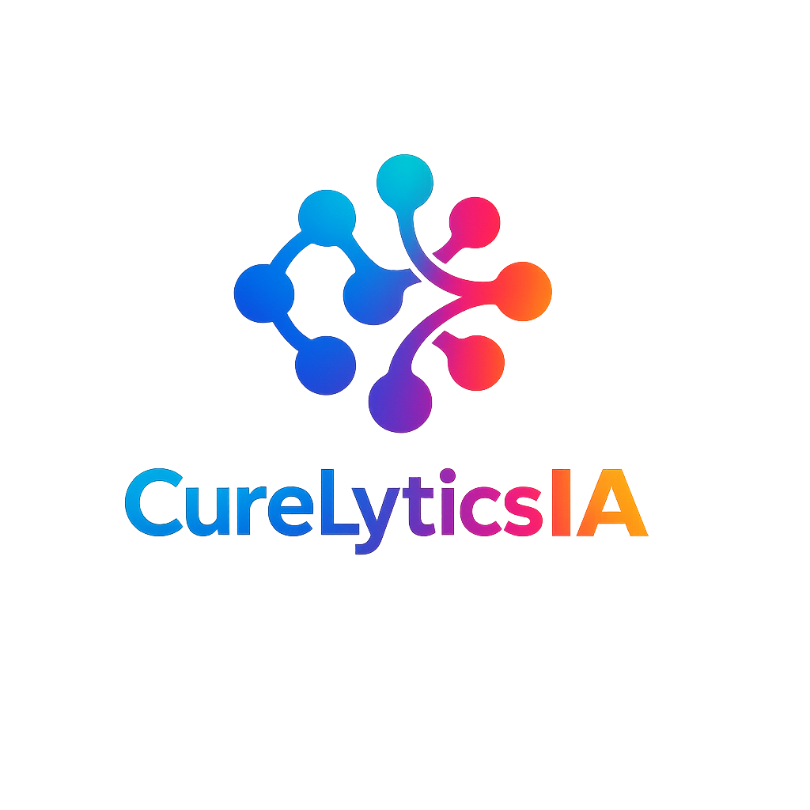

# Projet 10 — Labellisez et appliquez des approches semi-supervisées en traitement d'images

<p align="center">
  
</p>

**Auteur :** David MEDRAGH  
**Date :** Mai 2026  
**Durée estimée :** 40 heures

---

## Table des matières

- [Contexte du projet](#contexte-du-projet)
- [Mission](#mission)
  - [Ce que je vais apprendre](#ce-que-je-vais-apprendre)
  - [Pourquoi ces compétences sont importantes](#pourquoi-ces-compétences-sont-importantes)
  - [Contexte métier](#contexte-métier)
  - [Ma mission](#ma-mission)
  - [Contraintes et livrables](#contraintes-et-livrables)
  - [Organisation pédagogique](#organisation-pédagogique)
    - [Cours suivis](#cours-suivis)
    - [Option choisie](#option-choisie)
    - [Soutenance et autoévaluation](#soutenance-et-autoévaluation)
- [Objectifs pédagogiques](#objectifs-pédagogiques)
- [Structure du workspace](#structure-du-workspace)
  - [Arborescence du dépôt](#arborescence-du-dépôt)
- [Étape 1 — Importez les données et explorez le jeu de radiographies](#étape-1--importez-les-données-et-explorez-le-jeu-de-radiographies)
- [Étape 2 — Prétraitez et extrayez les features](#étape-2--prétraitez-et-extrayez-les-features)
- [Étape 3 — Réalisez une analyse non supervisée](#étape-3--réalisez-une-analyse-non-supervisée)
- [Étape 4 — Appliquez une méthode semi-supervisée](#étape-4--appliquez-une-méthode-semi-supervisée)

---

## Contexte du projet

Ce projet correspond à l'**Option B — Mission fictive** d'OpenClassrooms. Je travaille dans un scénario professionnel où je suis Data Scientist junior en Computer Vision chez **CurelyticsIA**, une startup de e-santé qui explore l'analyse d'images médicales pour assister les professionnels de santé.

La mission porte sur une première phase exploratoire du projet **BrainScanAI**. L'objectif est d'étudier un jeu d'images médicales majoritairement non étiquetées, d'exploiter un petit sous-ensemble annoté, puis d'évaluer si une approche semi-supervisée peut accélérer la labellisation et préparer un passage à l'échelle.

Ce README pose le cadre du projet 10. Les sections techniques détaillées seront ajoutées au fur et à mesure des éléments réellement produits dans le dépôt.

## Mission

### Ce que je vais apprendre

Dans ce projet, je vais consolider mes compétences en :

- **prétraitement d'images** et extraction de features avec des modèles pré-entraînés ;
- **analyse non-supervisée** : clustering, visualisation de la structure des données ;
- **application d'approches semi-supervisées** ;
- **clarté de présentation** de mes analyses.

Je vais pratiquer l'analyse non-supervisée (comme le clustering) pour détecter des structures dans les images. J'utiliserai des modèles pré-entraînés pour extraire des features visuelles. Je plongerai dans l'apprentissage semi-supervisé, un compromis entre supervision totale et autonomie du modèle. Cette méthode permet de tirer parti de données non labellisées.

### Pourquoi ces compétences sont importantes

Ces compétences sont utiles pour le traitement de données non-structurées comme les images. Elles sont essentielles dans des domaines comme la santé, l'industrie ou la surveillance visuelle. Les pratiques d'apprentissage semi-supervisé sont recherchées par les recruteurs en deep learning et en computer vision.

Savoir prétraiter les données et extraire des représentations pertinentes me permet de concevoir des modèles robustes. Être capable d'interpréter mes résultats est une qualité clé pour tout Data Scientist.

### Contexte métier

Je suis Data Scientist junior spécialisé en Computer Vision au sein de **CurelyticsIA**, une startup innovante dans le domaine de la e-santé. L'entreprise développe des solutions basées sur l'intelligence artificielle pour assister les professionnels de santé dans l'analyse d'images médicales, en particulier des IRM cérébrales.

Dans le cadre d'un nouveau projet R&D nommé **BrainScanAI**, Clara Martin, Responsable Data Science, me confie une première phase d'exploration et de modélisation. Le besoin métier est clair : explorer la possibilité d'automatiser la détection de tumeurs du cerveau à partir d'images médicales, alors que la majorité des données n'est pas étiquetée et qu'un sous-ensemble limité seulement a été annoté par des radiologues experts.

Le brief pédagogique mentionne un fichier ZIP transmis en pièce jointe, avec les images, une documentation technique et une liste restreinte de labels `normal` / `cancéreux`. Il introduit aussi une contrainte de coût sur la labellisation et une question de faisabilité à grande échelle, ce qui donne au projet une dimension à la fois technique et économique.

### Ma mission

Je suis chargé de concevoir une première exploration analytique du jeu de données. Plus précisément, ma mission est de :

- explorer les images et extraire des caractéristiques visuelles via un modèle pré-entraîné ;
- appliquer des méthodes de clustering pour identifier des structures ou regroupements dans les données ;
- mettre en œuvre une méthode d'apprentissage semi-supervisé à partir des quelques étiquettes disponibles ;
- synthétiser mes résultats, formuler des recommandations, et les présenter à mon équipe projet ;
- évaluer si un passage à l'échelle est envisageable pour un budget de **5 000 euros** sur **4 millions d'images** à labelliser, et préciser sous quelles conditions.

### Contraintes et livrables

Le cadrage de mission transmis par Clara Martin impose plusieurs contraintes de réalisation :

- travailler en **Python** ;
- tester **plusieurs algorithmes** ;
- choisir des **métriques pertinentes** selon le type d'erreur le plus critique : F1-score, accuracy, précision, rappel ou autre ;
- définir clairement ma **definition of done**, c'est-à-dire ce que je considère comme un objectif atteint.

Les livrables attendus sont également bien cadrés :

- un ou plusieurs **notebooks** documentant le preprocessing et l'extraction des features ;
- une analyse **non supervisée** avec exploration des données et entraînement de modèles de clustering ;
- une approche **semi-supervisée** permettant d'exploiter les labels partiels pour prédire les étiquettes manquantes ;
- un **support de présentation** qui synthétise mon approche, mes résultats et mes recommandations techniques ;
- une prise de position argumentée sur la **faisabilité d'un passage à l'échelle**, en intégrant la contrainte budgétaire.

### Organisation pédagogique

#### Cours suivis

Les deux cours associés à ce projet sont :

- "Initiez-vous au deep learning" — pour comprendre les enjeux du traitement d'image et du deep learning ;
- "Initiez-vous à l'apprentissage semi-supervisé" — pour apprendre le traitement d'images.

#### Option choisie

J'ai choisi l'**Option B — Mission fictive** : *Mission d'exploration et de modélisation — Données radios*. Je travaille dans un scénario de projet professionnel où je dois explorer des images médicales, comparer plusieurs approches, exploiter des labels partiels et produire des livrables comparables à ceux attendus dans une vraie phase R&D.

#### Soutenance et autoévaluation

À l'issue du projet, je complète la fiche d'autoévaluation qui sert de base d'échange avec mon mentor avant la soutenance. Je présente ensuite les livrables de la mission à un mentor évaluateur afin de valider les compétences visées.

## Objectifs pédagogiques

À l'issue de ce projet, je dois être capable de :

- identifier ou créer un modèle d'apprentissage adapté aux contraintes et aux besoins métier ;
- préparer et transformer des données afin de les adapter au modèle d'apprentissage.

## Structure du workspace

### Arborescence du dépôt

```text
projet10/
├── .gitignore                                                    # Exclusions Git du projet
├── README.md                                                     # Document de référence du projet
├── data/
│   └── mri_dataset_brain_cancer_oc/
│       ├── avec_labels/
│       │   ├── cancer/                                           # Images IRM annotées "cancer"
│       │   └── normal/                                           # Images IRM annotées "normal"
│       ├── sans_label/                                           # Images IRM non étiquetées
│       └── Jeu de Données d'Images Cérébrales pour la Détection de Tumeurs.txt
│                                                                  # Description du dataset
└── doc/
    └── logo/
        └── logo_CurelyticsIA.png                                 # Logo utilisé dans la documentation
```

## Étape 1 — Importez les données et explorez le jeu de radiographies

*À compléter.*

## Étape 2 — Prétraitez et extrayez les features

*À compléter.*

## Étape 3 — Réalisez une analyse non supervisée

*À compléter.*

## Étape 4 — Appliquez une méthode semi-supervisée

*À compléter.*
