# Projet 10 — Labellisez et appliquez des approches semi-supervisées en traitement d'images

<p align="center">
  
</p>

**Auteur :** David MEDRAGH  
**Date :** Mai 2026  
**Durée estimée :** 40 heures

---

## Table des matières

- [Contexte du projet](#contexte-du-projet)
- [Mission](#mission)
  - [Ce que je vais apprendre](#ce-que-je-vais-apprendre)
  - [Pourquoi ces compétences sont importantes](#pourquoi-ces-compétences-sont-importantes)
  - [Contexte métier](#contexte-métier)
  - [Ma mission](#ma-mission)
  - [Organisation pédagogique](#organisation-pédagogique)
    - [Cours suivis](#cours-suivis)
    - [Option choisie](#option-choisie)
    - [Soutenance et autoévaluation](#soutenance-et-autoévaluation)
- [Objectifs pédagogiques](#objectifs-pédagogiques)
- [Livrables](#livrables)
  - [Livrables à déposer](#livrables-à-déposer)
  - [Convention de nommage](#convention-de-nommage)
  - [Soutenance](#soutenance)
- [Vue d'ensemble du projet](#vue-densemble-du-projet)
  - [Architecture globale](#architecture-globale)
  - [Workflow global](#workflow-global)
  - [Stack technique globale](#stack-technique-globale)
  - [Écosystème technique global](#écosystème-technique-global)
  - [Diagrammes UML globaux](#diagrammes-uml-globaux)
    - [Workflow global du projet](#workflow-global-du-projet)
    - [Architecture technique globale](#architecture-technique-globale)
    - [Structure des livrables](#structure-des-livrables)
    - [Séquence du pipeline complet](#séquence-du-pipeline-complet)
    - [Cycle de vie d'une image dans le projet](#cycle-de-vie-dune-image-dans-le-projet)
    - [Cas d'usage global](#cas-dusage-global)
- [Dataset](#dataset)
  - [Source et description](#source-et-description)
  - [Structure du dataset](#structure-du-dataset)
  - [Diagramme de structure](#diagramme-de-structure)
  - [Caractéristiques des images](#caractéristiques-des-images)
  - [Écart constaté](#écart-constaté)
  - [Aperçus](#aperçus)
- [Étape 1 — Importez les données et explorez le jeu de radiographies](#étape-1--importez-les-données-et-explorez-le-jeu-de-radiographies)
  - [Résumé de l'exploration](#résumé-de-lexploration)
  - [Écarts identifiés](#écarts-identifiés)
  - [Observations clés](#observations-clés)
  - [Échantillon visuel](#échantillon-visuel)
  - [Synthèses visuelles](#synthèses-visuelles)
    - [Architecture détaillée de l'étape 1](#architecture-détaillée-de-létape-1)
    - [Stack technique de l'étape 1](#stack-technique-de-létape-1)
  - [Diagrammes UML](#diagrammes-uml)
    - [Architecture de l'étape 1](#architecture-de-létape-1)
    - [Workflow d'exploration](#workflow-dexploration)
    - [Contrôle qualité image par image](#contrôle-qualité-image-par-image)
    - [Cycle de vie d'une image](#cycle-de-vie-dune-image)
    - [Séquence d'inspection](#séquence-dinspection)
    - [Cas d'usage de l'exploration](#cas-dusage-de-lexploration)
  - [Livrables produits](#livrables-produits)
- [Étape 2 — Prétraitez et extrayez les features](#étape-2--prétraitez-et-extrayez-les-features)
  - [Objectif](#objectif)
  - [Pourquoi ResNet50](#pourquoi-resnet50)
  - [Modèle et preprocessing](#modèle-et-preprocessing)
  - [Dataset unifié](#dataset-unifié)
  - [Résultats de l'extraction](#résultats-de-lextraction)
  - [Synthèses visuelles](#synthèses-visuelles-1)
    - [Architecture générale de l'étape 2](#architecture-générale-de-létape-2)
    - [Architecture générale de l'étape 2 — variante](#architecture-générale-de-létape-2--variante)
    - [Stack technique de l'étape 2 — vue d'ensemble](#stack-technique-de-létape-2--vue-densemble)
    - [Stack technique détaillée de l'étape 2](#stack-technique-détaillée-de-létape-2)
    - [Architecture détaillée de l'étape 2](#architecture-détaillée-de-létape-2)
  - [Stack technique de l'étape 2](#stack-technique-de-létape-2)
    - [PyTorch](#pytorch)
    - [torchvision](#torchvision)
    - [OpenCV (cv2)](#opencv-cv2)
    - [PIL (Pillow)](#pil-pillow)
    - [NumPy](#numpy)
    - [pandas](#pandas)
    - [matplotlib](#matplotlib)
  - [Sauvegarde](#sauvegarde)
  - [Tableau exploitable](#tableau-exploitable)
  - [Diagrammes UML](#diagrammes-uml-1)
    - [Workflow global d'extraction](#workflow-global-dextraction)
    - [Architecture technique de l'extraction](#architecture-technique-de-lextraction)
    - [Pipeline de preprocessing ResNet50](#pipeline-de-preprocessing-resnet50)
    - [Extraction des embeddings en batch](#extraction-des-embeddings-en-batch)
    - [Séquence d'extraction des embeddings](#séquence-dextraction-des-embeddings)
    - [Cycle de vie d'une image vers son embedding](#cycle-de-vie-dune-image-vers-son-embedding)
    - [Structure logique des sorties features](#structure-logique-des-sorties-features)
    - [Cas d'usage de l'extraction de features](#cas-dusage-de-lextraction-de-features)
  - [Livrables produits](#livrables-produits-1)
- [Étape 3 — Réalisez une analyse non supervisée](#étape-3--réalisez-une-analyse-non-supervisée)
  - [Objectif](#objectif-2)
  - [Standardisation des features](#standardisation-des-features)
  - [Réduction de dimensionnalité (PCA)](#réduction-de-dimensionnalité-pca)
    - [Variance expliquée](#variance-expliquée)
    - [PCA intermédiaire (50D)](#pca-intermédiaire-50d)
  - [Visualisation t-SNE](#visualisation-t-sne)
  - [Clustering](#clustering)
    - [K-Means (k=2)](#k-means-k2)
    - [DBSCAN](#dbscan)
  - [Évaluation : score ARI](#évaluation--score-ari)
  - [Mapping cluster → classe](#mapping-cluster--classe)
  - [Pseudo-labellisation](#pseudo-labellisation)
  - [Synthèses visuelles](#synthèses-visuelles-2)
    - [Architecture générale de l'étape 3](#architecture-générale-de-létape-3)
    - [Architecture détaillée de l'étape 3](#architecture-détaillée-de-létape-3)
    - [Stack technique de l'étape 3](#stack-technique-de-létape-3)
    - [Stack technique de l'étape 3 — variante](#stack-technique-de-létape-3--variante)
  - [Discussion](#discussion)
  - [Diagrammes UML](#diagrammes-uml-2)
    - [Workflow global de l'analyse non supervisée](#workflow-global-de-lanalyse-non-supervisée)
    - [Architecture technique du clustering](#architecture-technique-du-clustering)
    - [Standardisation des features](#standardisation-des-features-1)
    - [Réduction de dimension PCA et t-SNE](#réduction-de-dimension-pca-et-t-sne)
    - [Clustering K-Means et DBSCAN](#clustering-k-means-et-dbscan)
    - [Évaluation par ARI](#évaluation-par-ari)
    - [Pseudo-labellisation séparée](#pseudo-labellisation-séparée)
    - [Séquence du pipeline de clustering](#séquence-du-pipeline-de-clustering)
    - [Cycle d'une image vers son pseudo-label](#cycle-dune-image-vers-son-pseudo-label)
    - [Structure des sorties clustering](#structure-des-sorties-clustering)
    - [Cas d'usage de l'analyse non supervisée](#cas-dusage-de-lanalyse-non-supervisée)
  - [Livrables produits](#livrables-produits-2)
- [Étape 4 — Appliquez une méthode semi-supervisée](#étape-4--appliquez-une-méthode-semi-supervisée)
  - [Objectif](#objectif-3)
  - [Protocole anti-fuite](#protocole-anti-fuite)
  - [Split des données](#split-des-données)
  - [Re-clustering propre](#re-clustering-propre)
  - [Architecture CNN](#architecture-cnn)
  - [Modèle A — Supervisé pur](#modèle-a--supervisé-pur)
  - [Modèle B — Semi-supervisé](#modèle-b--semi-supervisé)
  - [Comparaison des résultats](#comparaison-des-résultats)
  - [Justification métier](#justification-métier)
  - [Recommandations — Passage à l'échelle](#recommandations--passage-à-léchelle)
  - [Synthèses visuelles](#synthèses-visuelles-3)
    - [Architecture générale de l'étape 4](#architecture-générale-de-létape-4)
    - [Architecture détaillée de l'étape 4](#architecture-détaillée-de-létape-4)
    - [Stack technique générale de l'étape 4](#stack-technique-générale-de-létape-4)
    - [Stack technique détaillée de l'étape 4](#stack-technique-détaillée-de-létape-4)
  - [Diagrammes UML](#diagrammes-uml-3)
    - [Workflow global de l'apprentissage semi-supervisé](#workflow-global-de-lapprentissage-semi-supervisé)
    - [Architecture technique CNN semi-supervisée](#architecture-technique-cnn-semi-supervisée)
    - [Split et logique anti-fuite](#split-et-logique-anti-fuite)
    - [Préparation des DataLoaders](#préparation-des-dataloaders)
    - [Fine-tuning de ResNet50](#fine-tuning-de-resnet50)
    - [Entraînement supervisé pur](#entraînement-supervisé-pur)
    - [Entraînement semi-supervisé](#entraînement-semi-supervisé)
    - [Évaluation des métriques](#évaluation-des-métriques)
    - [Comparaison supervisé pur vs semi-supervisé](#comparaison-supervisé-pur-vs-semi-supervisé)
    - [Séquence du pipeline semi-supervisé](#séquence-du-pipeline-semi-supervisé)
    - [Cycle d'une image dans l'entraînement](#cycle-dune-image-dans-lentraînement)
    - [Structure des sorties semi-supervisées](#structure-des-sorties-semi-supervisées)
    - [Cas d'usage de l'apprentissage semi-supervisé](#cas-dusage-de-lapprentissage-semi-supervisé)
  - [Livrables produits](#livrables-produits-3)

---

## Contexte du projet

Au fil de mon parcours, j'ai découvert les concepts de traitement d'images, d'analyse non-supervisée et de deep learning dans des contextes complexes. Ce nouveau projet me permet de consolider ces acquis en les appliquant de manière transversale : du prétraitement d'images à l'apprentissage semi-supervisé, en passant par l'extraction de features et le clustering.

Ce README pose le cadre du projet 10. Les sections techniques détaillées seront ajoutées au fur et à mesure des éléments réellement produits.

## Mission

### Ce que je vais apprendre

Dans ce projet, je vais consolider mes compétences en :

- **prétraitement d'images** et extraction de features avec des modèles pré-entraînés ;
- **analyse non-supervisée** : clustering, visualisation de la structure des données ;
- **application d'approches semi-supervisées** ;
- **clarté de présentation** de mes analyses.

Je vais pratiquer l'analyse non-supervisée (comme le clustering) pour détecter des structures dans les images. J'utiliserai des modèles pré-entraînés pour extraire des features visuelles. Je plongerai dans l'apprentissage semi-supervisé, un compromis entre supervision totale et autonomie du modèle. Cette méthode permet de tirer parti de données non labellisées.

### Pourquoi ces compétences sont importantes

Ces compétences sont utiles pour le traitement de données non-structurées comme les images. Elles sont essentielles dans des domaines comme la santé, l'industrie ou la surveillance visuelle. Les pratiques d'apprentissage semi-supervisé sont recherchées par les recruteurs en deep learning et en computer vision.

Savoir prétraiter les données et extraire des représentations pertinentes me permet de concevoir des modèles robustes. Être capable d'interpréter mes résultats est une qualité clé pour tout Data Scientist.

### Contexte métier

Je suis Data Scientist junior spécialisé en Computer Vision au sein de **CurelyticsIA**, une startup innovante dans le domaine de la e-santé. L'entreprise développe des solutions basées sur l'intelligence artificielle pour assister les professionnels de santé dans l'analyse d'images médicales, en particulier des IRM.

Dans le cadre d'un nouveau projet R&D, CurelyticsIA souhaite explorer la possibilité d'automatiser la détection de tumeurs du cerveau. Un ensemble conséquent de radios a été collecté : la majorité de ces images ne dispose d'aucun étiquetage, tandis qu'un sous-ensemble limité a été annoté par des radiologues experts.

### Ma mission

Je suis chargé de concevoir une première exploration analytique du jeu de données. Plus précisément, ma mission est de :

- explorer les images et extraire des caractéristiques visuelles via un modèle pré-entraîné ;
- appliquer des méthodes de clustering pour identifier des structures ou regroupements dans les données ;
- mettre en œuvre une méthode d'apprentissage semi-supervisé à partir des quelques étiquettes disponibles ;
- synthétiser mes résultats, formuler des recommandations, et les présenter à mon équipe projet.

### Organisation pédagogique

#### Cours suivis

Les deux cours associés à ce projet sont :

- "Initiez-vous au deep learning" — pour comprendre les enjeux du traitement d'image et du deep learning ;
- "Initiez-vous à l'apprentissage semi-supervisé" — pour apprendre le traitement d'images.

#### Option choisie

J'ai choisi l'**Option B — Mission fictive** : *Mission d'exploration et de modélisation — Données radios*. J'analyse des images médicales avec des méthodes semi-supervisées, dans un cadre structuré proche d'un cas réel, avec un dataset fourni.

#### Soutenance et autoévaluation

À l'issue du projet, je complète la fiche d'autoévaluation qui sert de base d'échange avec mon mentor avant la soutenance. Je présente ensuite les livrables de la mission à un mentor évaluateur afin de valider les compétences visées.

## Objectifs pédagogiques

À l'issue de ce projet, je dois être capable de :

- identifier ou créer un modèle d'apprentissage adapté aux contraintes et aux besoins métier ;
- préparer et transformer des données afin de les adapter au modèle d'apprentissage.

## Livrables

### Livrables à déposer

| # | Livrable | Format |
|---|---------|--------|
| 1 | Notebook contenant : extraction des features, preprocessing adapté au(x) modèle(s) utilisé(s), analyse non-supervisée, entraînement de modèles de clustering | `.ipynb` |
| 2 | Notebook contenant : approche semi-supervisée | `.ipynb` |
| 3 | Support de présentation | `.pdf` ou `.ppt` (15 slides max) |

### Convention de nommage

Tous les livrables sont déposés dans un dossier zip nommé `Titre_du_projet_nom_prenom`.

Chaque fichier suit le format : `Nom_Prenom_n°_nom_du_livrable_mmaaaa`

- `MEDRAGH_David_1_Notebook_052026`
- `MEDRAGH_David_2_Notebook_052026`
- `MEDRAGH_David_3_Presentation_052026`

### Soutenance

L'évaluateur joue le rôle de **Clara**, responsable Data Science de CurelyticsIA.

| Phase | Durée |
|-------|-------|
| Présentation des livrables (choix méthodologiques, résultats, recommandations) | 15 min |
| Discussion (questions sur les décisions, méthodes et approches) | 10 min |
| Débrief | 5 min |

La présentation doit durer entre 10 et 20 minutes.

## Vue d'ensemble du projet

Cette section rassemble quatre visuels transverses et une série de diagrammes UML globaux qui synthétisent la logique complète du projet 10, depuis le dataset initial jusqu'à la comparaison finale entre approche supervisée pure et approche semi-supervisée.

### Architecture globale

Cette vue met en avant les grands blocs fonctionnels du projet : exploration du corpus, extraction de features, clustering exploratoire, pseudo-labellisation et entraînement CNN.

<p align="center">
  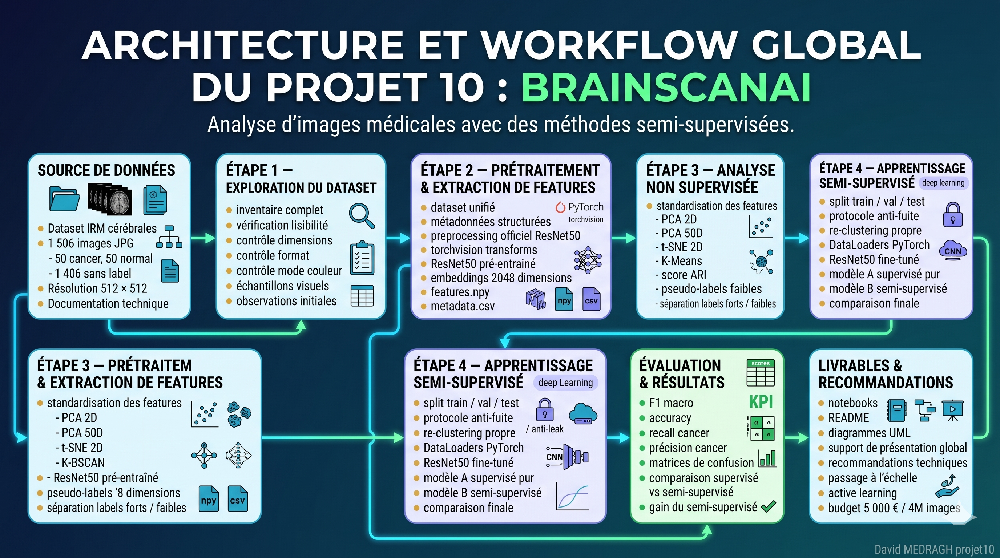
</p>

### Workflow global

Cette vue complète la précédente en insistant sur l'enchaînement méthodologique des étapes et sur la continuité entre préparation des données, modélisation et restitution finale.

<p align="center">
  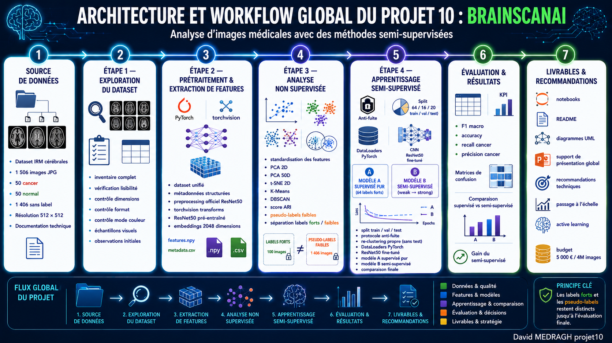
</p>

### Stack technique globale

Cette vue présente les briques techniques principales mobilisées sur l'ensemble du projet, de l'exploration initiale jusqu'à l'apprentissage semi-supervisé.

<p align="center">
  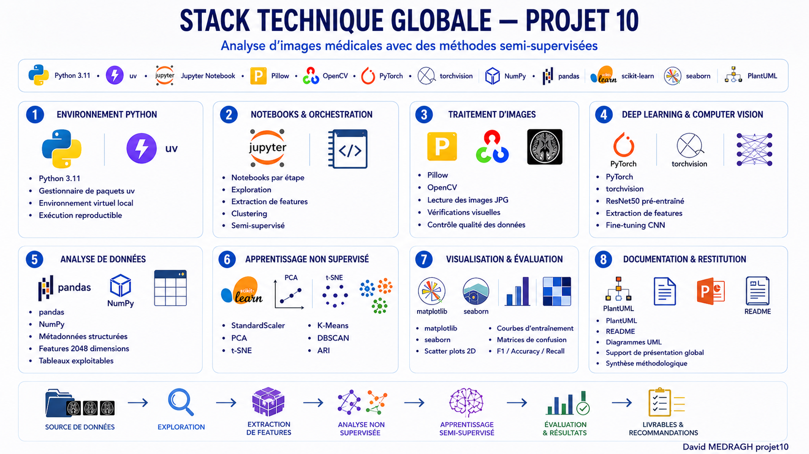
</p>

### Écosystème technique global

Cette vue complète la stack globale en mettant davantage l'accent sur l'organisation de l'écosystème logiciel utilisé pour les notebooks, les analyses, les visualisations et la documentation.

<p align="center">
  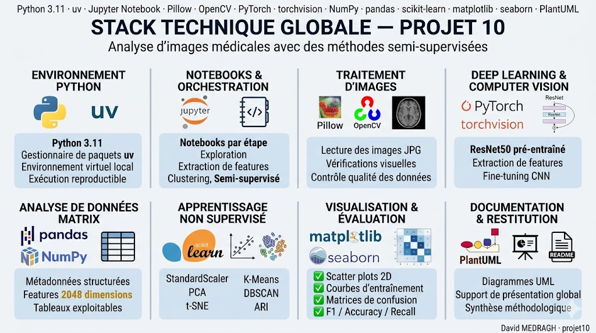
</p>

### Diagrammes UML globaux

Les diagrammes ci-dessous complètent les visuels de synthèse en documentant le projet sous un angle plus méthodologique et plus technique.

#### Workflow global du projet

Ce diagramme d'activité montre la progression complète du projet, du dataset brut jusqu'à la restitution finale des résultats.

<p align="center">
  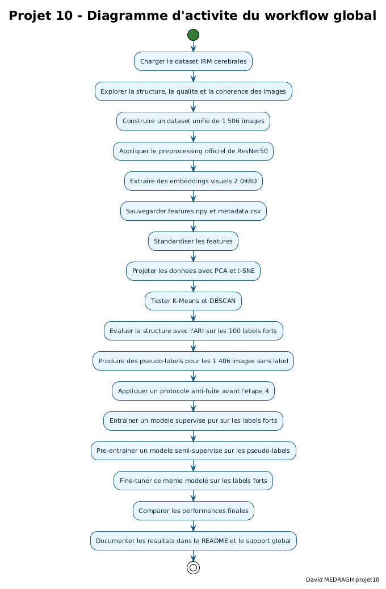
</p>

#### Architecture technique globale

Ce diagramme de composants relie le corpus d'images, les notebooks, les fichiers intermédiaires, les pseudo-labels, le support global et le `README`.

<p align="center">
  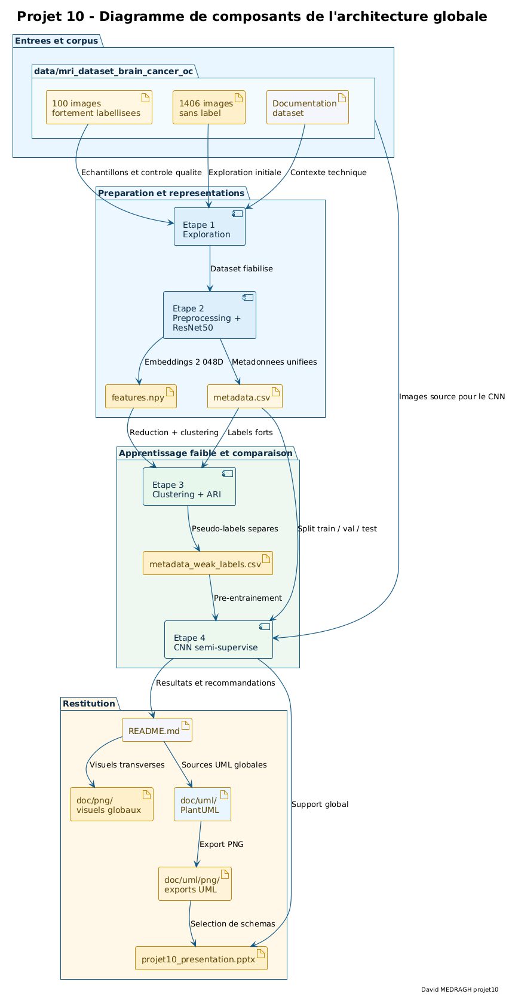
</p>

#### Structure des livrables

Ce diagramme de packages présente l'organisation logique du workspace, des données, de la documentation, des notebooks et des livrables finaux.

<p align="center">
  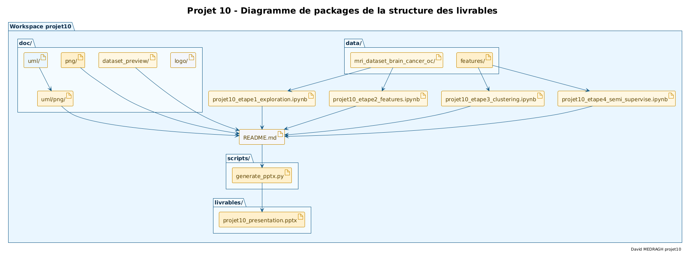
</p>

#### Séquence du pipeline complet

Ce diagramme de séquence représente les interactions entre le Data Scientist junior, les notebooks des quatre étapes, le dataset, le `README` et le support global.

<p align="center">
  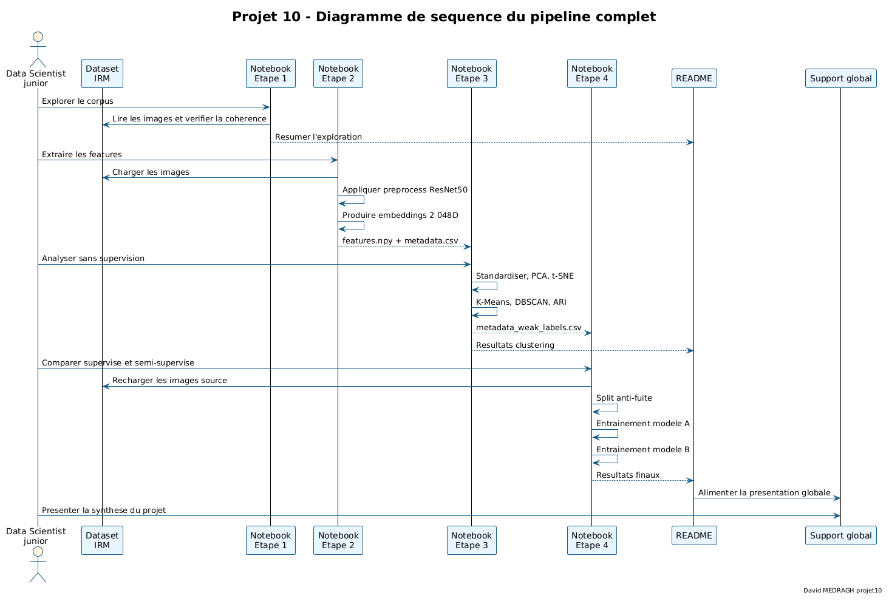
</p>

#### Cycle de vie d'une image dans le projet

Ce diagramme d'états suit une image depuis sa présence dans le dataset brut jusqu'à sa prédiction finale dans les approches supervisée et semi-supervisée.

<p align="center">
  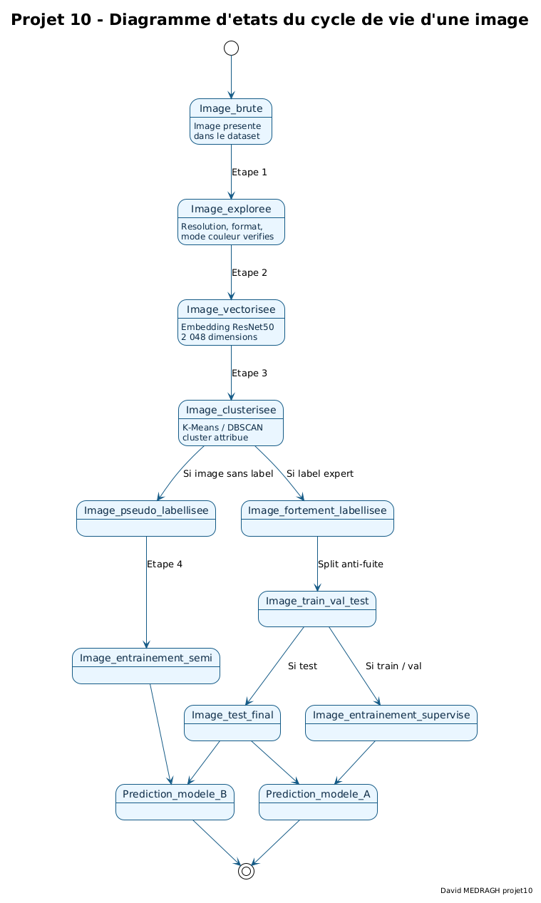
</p>

#### Cas d'usage global

Ce diagramme de cas d'usage résume les grandes actions du projet du point de vue du Data Scientist junior.

<p align="center">
  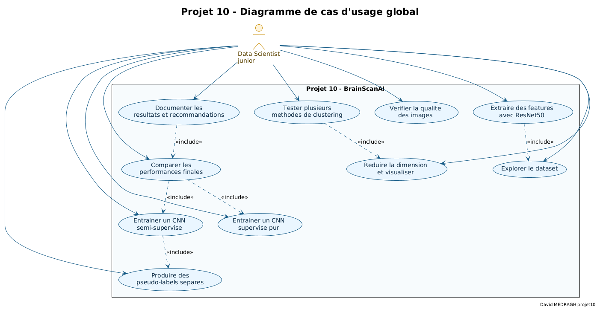
</p>

## Dataset

### Source et description

Le jeu de données est un ensemble d'IRM cérébrales fourni dans le cadre du projet. Il est décrit dans le fichier `data/mri_dataset_brain_cancer_oc/Jeu de Données d'Images Cérébrales pour la Détection de Tumeurs.txt`. Sa licence autorise une utilisation libre à des fins académiques.

### Structure du dataset

```
data/mri_dataset_brain_cancer_oc/
├── avec_labels/
│   ├── cancer/       → 50 images (IRM avec signes de tumeurs)
│   └── normal/       → 50 images (IRM de cerveaux sains)
└── sans_label/       → 1 406 images (IRM non étiquetées)
```

| Catégorie | Nombre d'images |
|-----------|----------------:|
| Labellisées — cancer | 50 |
| Labellisées — normal | 50 |
| Non labellisées | 1 406 |
| **Total** | **1 506** |

### Diagramme de structure

Le diagramme ci-dessous complète l'arborescence textuelle du dataset. Il représente la structure logique des dossiers et la répartition entre les images labellisées et non labellisées.

<p align="center">
  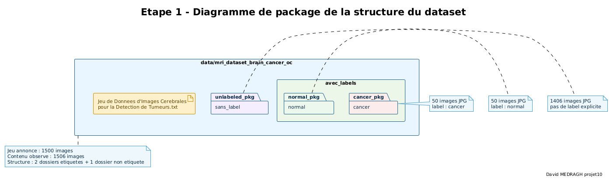
</p>

### Caractéristiques des images

- **Format** : JPEG (`.jpg`)
- **Taille standardisée** : 512 × 512 pixels

### Écart constaté

Le fichier descriptif du dataset annonce **1 400** images non étiquetées et **1 500** images au total. Le contenu réel du dépôt contient **1 406** images non étiquetées, soit un total de **1 506** images. Cet écart de 6 images est documenté ici et sera vérifié lors de l'exploration en étape 1.

### Aperçus

Trois aperçus visuels du dataset sont disponibles dans `doc/dataset_preview/` :

| Aperçu | Fichier |
|--------|--------|
| IRM cancer | `doc/dataset_preview/apercu_cancer.jpg` |
| IRM normal | `doc/dataset_preview/apercu_normal.jpg` |
| IRM sans label | `doc/dataset_preview/apercu_sans_label.jpg` |

## Étape 1 — Importez les données et explorez le jeu de radiographies

### Résumé de l'exploration

J'ai réalisé un scan exhaustif des 1 506 images du dataset. Les résultats sont les suivants :

| Dossier | Images | Dimensions | Mode couleur | Format | Erreurs |
|---------|-------:|------------|--------------|--------|---------|
| cancer | 50 | 512×512 | RGB | JPEG | 0 |
| normal | 50 | 512×512 | RGB | JPEG | 0 |
| sans_label | 1 406 | 512×512 | RGB | JPEG | 0 |
| **Total** | **1 506** | | | | **0** |

- Toutes les images sont lisibles — aucune corrompue
- Résolution homogène sur l'ensemble du dataset
- Mode couleur uniformément RGB (3 canaux)
- Aucun doublon de nom de fichier entre les 3 dossiers

Cette première vue d'ensemble pose le cadre technique de l'exploration et les bibliothèques mobilisées dès l'ouverture du notebook.

<p align="center">
  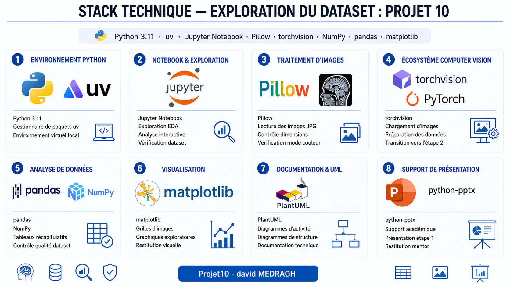
</p>

### Écarts identifiés

| Critère | Énoncé | Réel | Commentaire |
|---------|--------|------|-------------|
| Format | PNG (courriel de mission) | JPEG (.jpg) | Le fichier descriptif du dataset confirme le JPEG |
| Images non étiquetées | 1 400 | 1 406 | +6 images par rapport à l'annonce |
| Total | 1 500 | 1 506 | Écart cohérent avec le surplus de non étiquetées |
| Métadonnées séparées | Non mentionnées | Absentes | La structure de dossiers fait office de labellisation |

Ces écarts sont mineurs et documentés. Je retiens les chiffres réels pour la suite.

### Observations clés

- Le dataset est propre, homogène et exploitable en l'état
- Le déséquilibre est marqué : seulement 100 images labellisées pour 1 406 non labellisées (~6,6 % de labels) — c'est précisément le contexte qui justifie une approche semi-supervisée
- Toutes les images sont en RGB : pas de conversion de mode nécessaire à l'étape 2
- Les images sont en 512×512, je les redimensionnerai au format attendu par le modèle pré-entraîné (ex. 224×224 pour ResNet50)

### Échantillon visuel

L'aperçu ci-dessous reprend l'échantillon affiché dans le notebook, avec `5` images par catégorie : `cancer`, `normal` et `sans_label`. Il permet de visualiser rapidement le contenu réel du corpus avant les étapes de prétraitement et d'extraction de features.

<p align="center">
  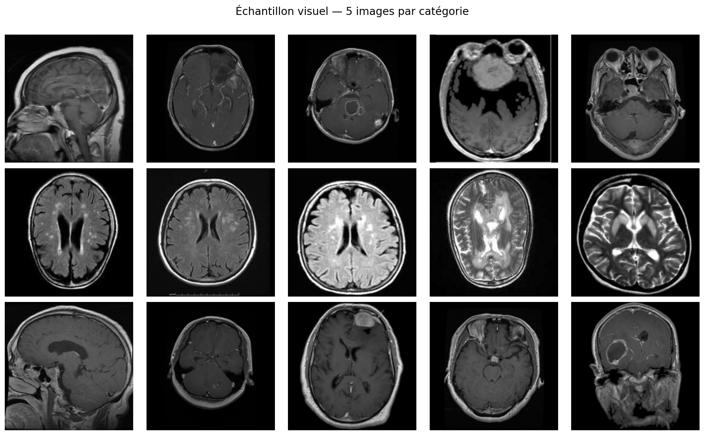
</p>

### Synthèses visuelles

Deux infographies de synthèse complètent cette étape. Elles donnent une vue plus visuelle du workflow d'exploration et de la stack technique mobilisée autour du notebook, des contrôles qualité et des livrables produits.

#### Architecture détaillée de l'étape 1

Cette vue regroupe, sur une seule infographie, la source de données, l'environnement de travail, l'exploration visuelle, le contrôle qualité, l'analyse des constats et les livrables de l'étape 1.

<p align="center">
  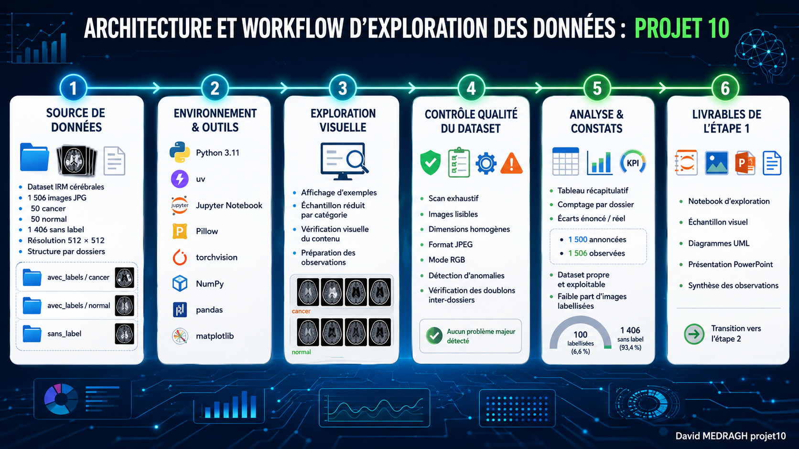
</p>

#### Stack technique de l'étape 1

Cette vue recentre l'attention sur l'environnement du notebook, le traitement d'images, l'écosystème computer vision et les outils de documentation utilisés pendant l'étape 1.

<p align="center">
  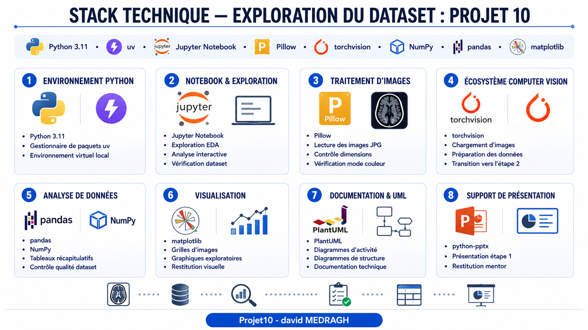
</p>

### Diagrammes UML

Pour documenter l'étape 1, j'ai préparé plusieurs diagrammes UML en PlantUML. Ils complètent le notebook d'exploration, explicitent la logique de contrôle qualité et montrent comment les données alimentent les livrables produits.

#### Architecture de l'étape 1

Ce diagramme d'architecture relie le dataset source, le notebook d'exploration, l'échantillon visuel et le support de présentation.

<p align="center">
  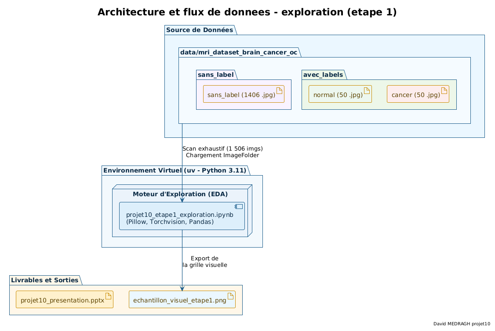
</p>

#### Workflow d'exploration

Ce diagramme d'activité synthétise le déroulé global de l'étape 1, depuis l'inventaire du corpus jusqu'à la rédaction des observations qui préparent l'étape 2.

<p align="center">
  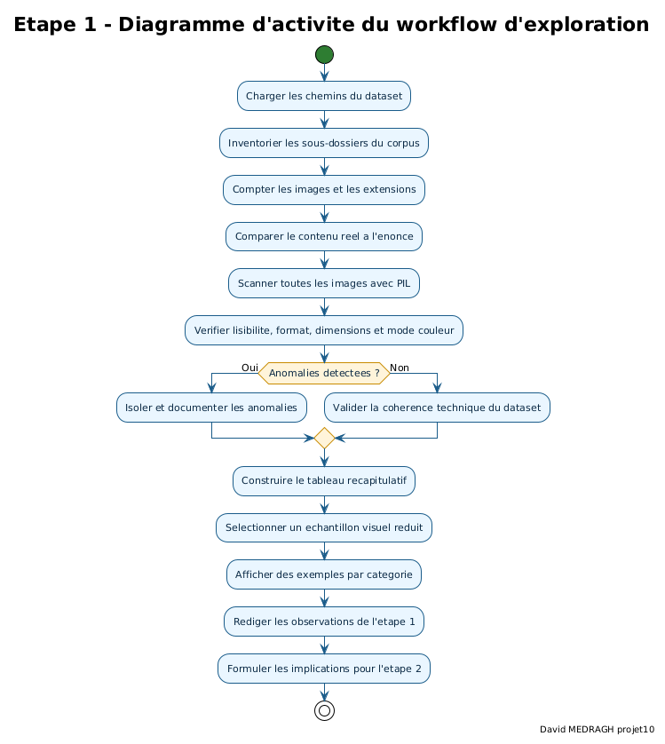
</p>

#### Contrôle qualité image par image

Ce diagramme d'activité détaille la vérification appliquée à chaque fichier image : lisibilité, format, dimensions et mode couleur.

<p align="center">
  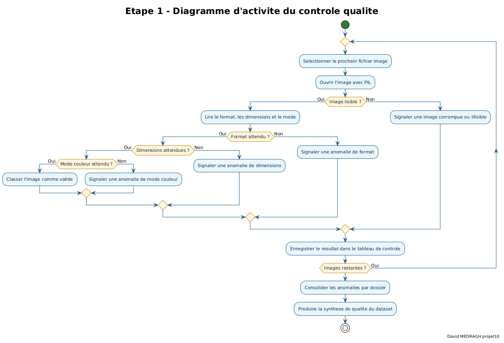
</p>

#### Cycle de vie d'une image

Ce diagramme d'états montre le passage d'une image de sa détection dans le corpus à sa validation ou à son classement comme anomalie.

<p align="center">
  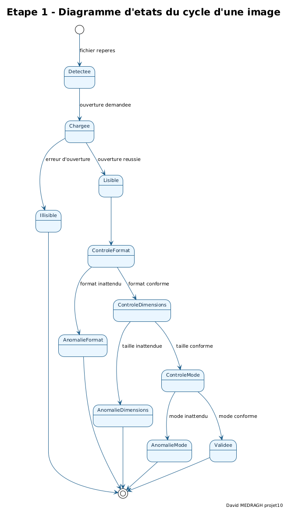
</p>

#### Séquence d'inspection

Ce diagramme de séquence représente les interactions entre le notebook, le système de fichiers, PIL, pandas et matplotlib pendant l'inspection du dataset.

<p align="center">
  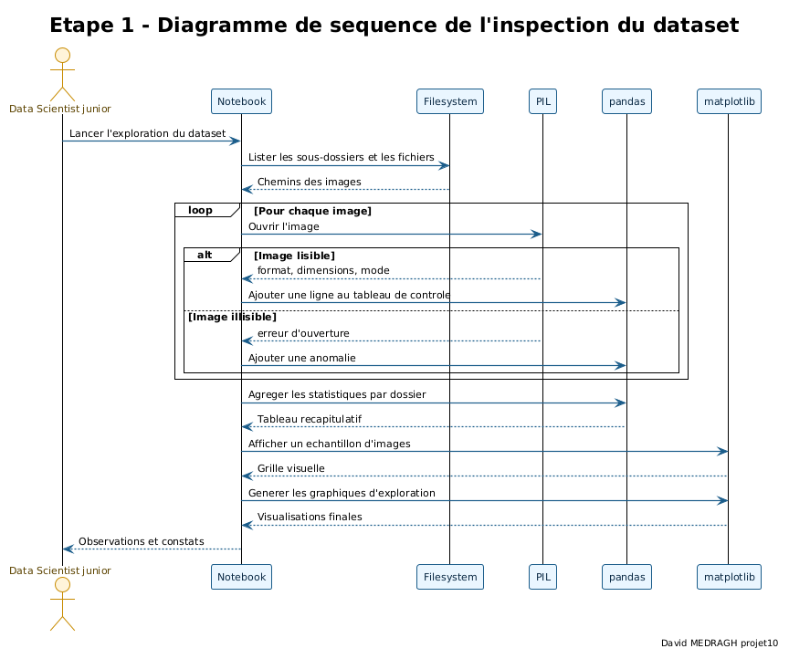
</p>

#### Cas d'usage de l'exploration

Ce diagramme de cas d'usage résume les actions principales réalisées pendant l'étape 1 du point de vue du Data Scientist junior.

<p align="center">
  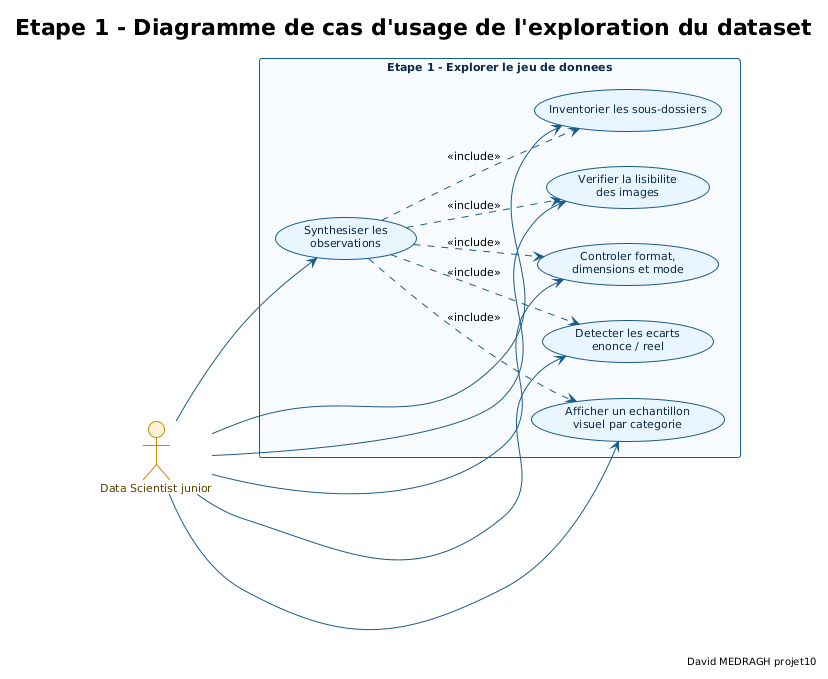
</p>

Cette dernière vue de synthèse replace la stack technique dans une logique de restitution académique, au plus près des livrables de l'étape 1.

<p align="center">
  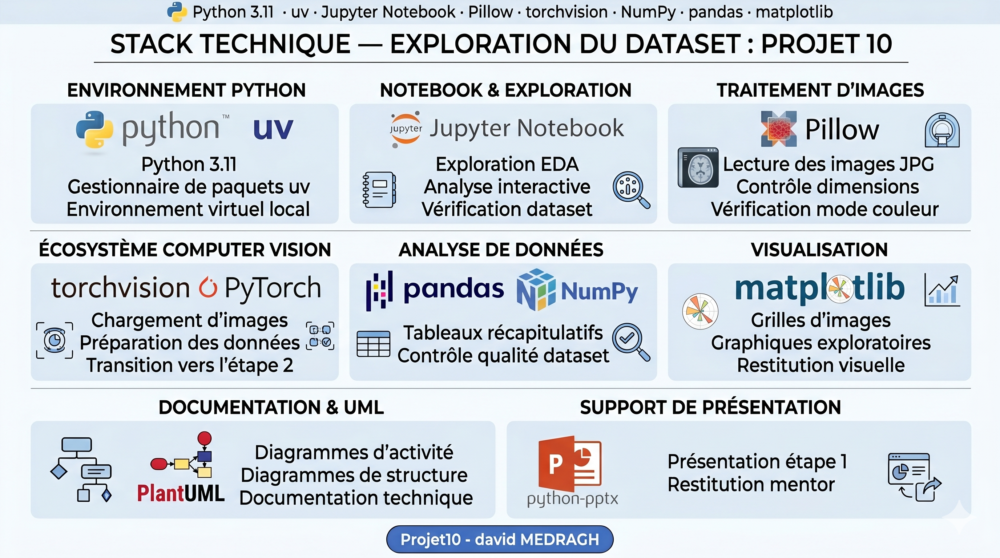
</p>

### Livrables produits

| Livrable | Chemin |
|----------|--------|
| Notebook d'exploration | `projet10_etape1_exploration.ipynb` |
| Support de présentation | `livrables/projet10_presentation.pptx` |
| Échantillon visuel | `doc/dataset_preview/echantillon_visuel_etape1.png` |
| Infographie d'architecture détaillée | `doc/png/architecture_detaillé_étape1.png` |
| Vue d'ensemble de la stack technique | `doc/png/stack_technique_readme_etape1.png` |
| Vue notebook de la stack technique | `doc/png/stack_technique_notebook_etape1.png` |
| Vue présentation de la stack technique | `doc/png/stack_technique_slide_etape1.png` |
| Sources PlantUML | `doc/uml/` |
| Exports PNG des diagrammes | `doc/uml/png/` |

## Étape 2 — Prétraitez et extrayez les features

### Objectif

Dans cette étape, j'ai préparé les images (redimensionnement, normalisation) et utilisé un modèle pré-entraîné (ResNet50) pour extraire des embeddings visuels. L'objectif est d'obtenir un vecteur de features pour chaque image, sauvegardé dans un tableau exploitable.

### Pourquoi ResNet50

ResNet50 (Residual Network à 50 couches) est un réseau de neurones convolutif (CNN) publié par Microsoft Research en 2015. Il a introduit les **connexions résiduelles** (skip connections) qui permettent d'entraîner des réseaux beaucoup plus profonds sans dégradation des performances.

Je l'utilise ici comme **extracteur de features** et non comme classifieur :

- **Pré-entraîné sur ImageNet** : le modèle a appris à reconnaître des motifs visuels sur 1,2 million d'images réparties en 1 000 classes. Ces représentations apprises sont transférables à d'autres domaines, y compris l'imagerie médicale.
- **Transfer learning** : plutôt que d'entraîner un CNN depuis zéro (ce qui nécessiterait des milliers d'images labellisées), je réutilise les couches convolutionnelles de ResNet50 pour extraire des caractéristiques visuelles pertinentes de mes IRM.
- **Sortie `avgpool`** : la dernière couche de pooling produit un vecteur dense de **2 048 valeurs** par image. Ce vecteur résume les informations visuelles de l'image et constitue l'embedding que j'utiliserai pour le clustering (étape 3) et l'apprentissage semi-supervisé (étape 4).
- **Recommandé par l'école** : l'énoncé mentionne explicitement "ResNet ou équivalent" comme modèle à utiliser.

### Modèle et preprocessing

| Choix | Détail |
|-------|--------|
| Modèle | ResNet50 (`ResNet50_Weights.DEFAULT`) — poids ImageNet |
| Preprocessing | `weights.transforms()` — pipeline officiel (Resize 232, CenterCrop 224, Normalize ImageNet) |
| Extraction | Sortie `avgpool` via `model.fc = nn.Identity()` → vecteur 2 048-d par image |
| Couches gelées | `requires_grad=False` sur tous les paramètres |
| Mode inférence | `model.eval()` + `torch.no_grad()` |
| Device | CPU (GPU non disponible) — extraction en ~108 secondes |

### Dataset unifié

J'ai construit un DataFrame unique regroupant les 1 506 images avec des métadonnées complètes :

| Colonne | Contenu |
|---------|---------|
| `path` | Chemin complet de l'image |
| `filename` | Nom du fichier |
| `dossier` | cancer / normal / sans_label |
| `label_name` | "cancer" / "normal" / None |
| `label_id` | 0 / 1 / `pd.NA` (nullable integer) |
| `is_labeled` | True / False |

### Résultats de l'extraction

| Métrique | Valeur |
|----------|--------|
| Images traitées | 1 506 / 1 506 |
| Dimension features | (1 506, 2 048) |
| NaN | 0 |
| Inf | 0 |
| Min | 0.0000 |
| Max | 8.1477 |
| Mean | 0.1007 |
| Std | 0.3043 |

### Synthèses visuelles

Les infographies ci-dessous complètent le notebook et le support global. Elles donnent une lecture rapide de l'étape 2 sous trois angles : le workflow global, la stack technique mobilisée et la structure détaillée des sorties.

#### Architecture générale de l'étape 2

Cette première vue d'ensemble résume le passage du dataset source vers le DataFrame unifié, le preprocessing officiel de ResNet50, l'extraction des embeddings et les livrables produits.

<p align="center">
  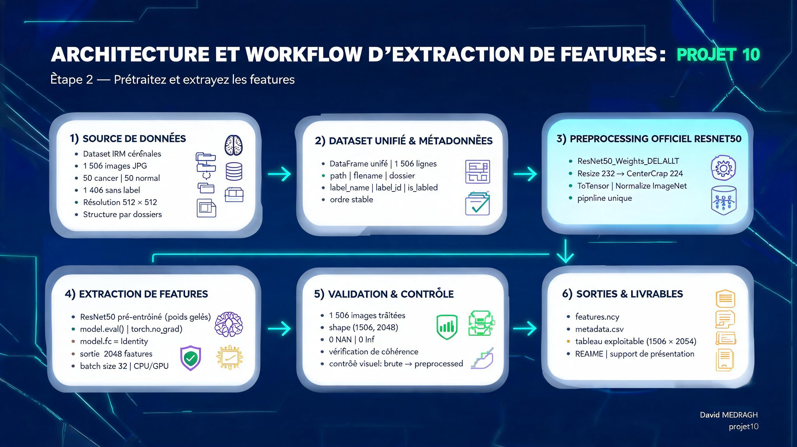
</p>

#### Architecture générale de l'étape 2 — variante

Cette variante reprend le même enchaînement avec une présentation plus synthétique, utile pour une lecture rapide en support de présentation.

<p align="center">
  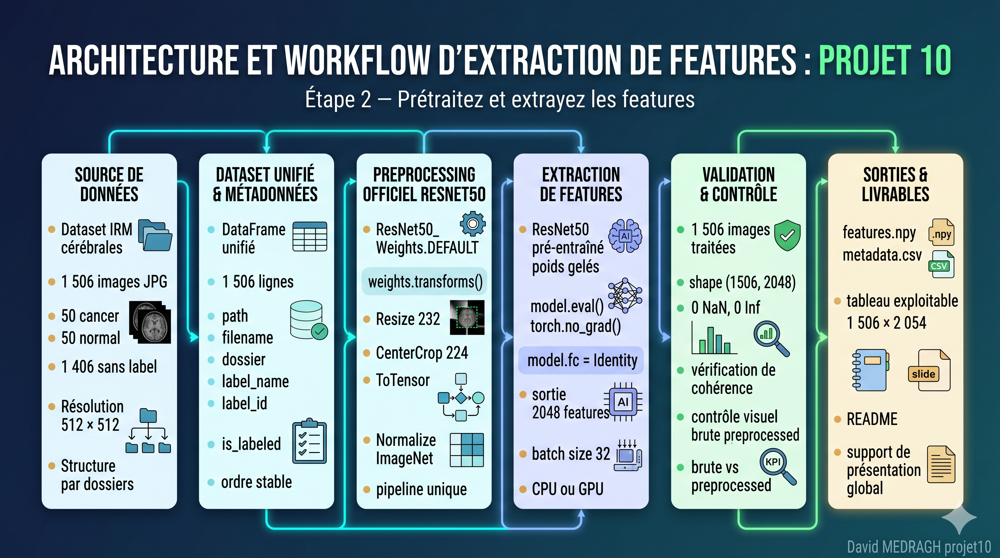
</p>

#### Stack technique de l'étape 2 — vue d'ensemble

Cette vue recentre l'attention sur l'environnement Python, le notebook, le traitement d'images, l'écosystème PyTorch et la restitution des résultats.

<p align="center">
  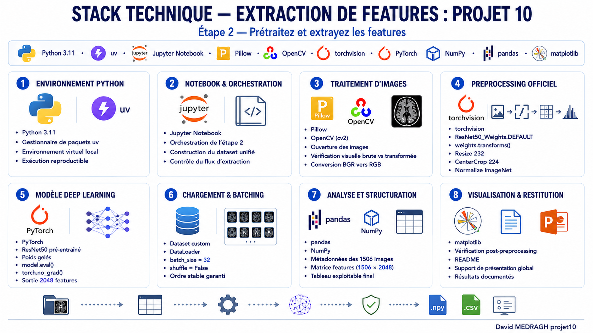
</p>

#### Stack technique détaillée de l'étape 2

Cette version détaillée explicite davantage les outils mobilisés, la logique d'orchestration du notebook et les composants utilisés pendant l'extraction des features.

<p align="center">
  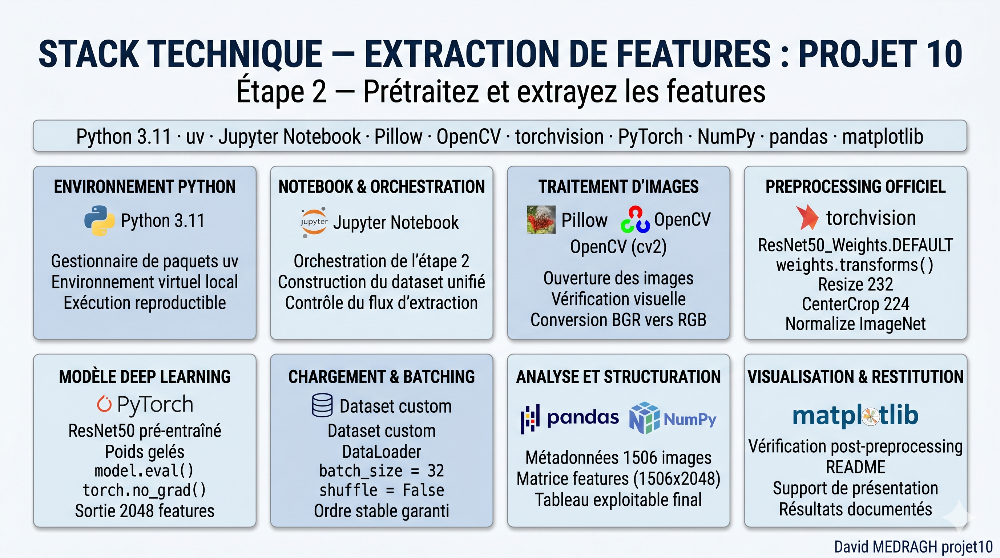
</p>

#### Architecture détaillée de l'étape 2

Cette vue détaillée met en avant la chronologie complète de l'étape 2, depuis la source de données jusqu'aux fichiers `features.npy` et `metadata.csv`, avec les contrôles appliqués au passage.

<p align="center">
  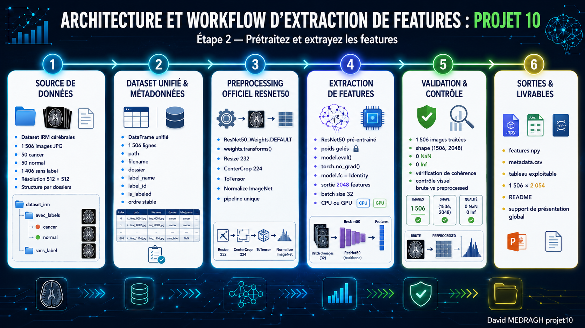
</p>

### Stack technique de l'étape 2

#### PyTorch

PyTorch est le framework de deep learning que j'utilise pour cette étape. Développé par Meta (Facebook AI Research), c'est aujourd'hui l'un des deux standards de l'industrie avec TensorFlow. Je l'utilise ici pour :
- charger le modèle ResNet50 pré-entraîné et gérer ses paramètres (gel des poids, mode inférence)
- gérer les tenseurs (les structures de données qui représentent les images et les features)
- contrôler le calcul des gradients (`torch.no_grad()`) pour économiser la mémoire pendant l'extraction

#### torchvision

torchvision est la bibliothèque de vision par ordinateur de l'écosystème PyTorch. Elle fournit :
- **les modèles pré-entraînés** : ResNet50, EfficientNet, ViT, etc., avec leurs poids officiels
- **le preprocessing officiel** : `weights.transforms()` qui applique exactement les mêmes transformations que lors de l'entraînement du modèle (Resize, CenterCrop, Normalize)
- **le DataLoader** : un chargeur de données en batch qui permet de traiter les images par groupes de 32 pour optimiser la mémoire

#### OpenCV (cv2)

OpenCV (Open Source Computer Vision Library) est une bibliothèque de traitement d'images recommandée par l'école. Développée initialement par Intel, elle offre des fonctions de manipulation d'images (redimensionnement, filtres, conversion de couleurs, détection de contours). Dans cette étape, je l'utilise pour charger les images brutes et effectuer la conversion BGR→RGB lors de la vérification visuelle post-preprocessing.

#### PIL (Pillow)

Pillow est la bibliothèque Python standard pour l'ouverture et la manipulation d'images. Je l'utilise dans le Dataset custom pour ouvrir chaque image avant de lui appliquer le preprocessing torchvision. Elle gère nativement la conversion entre modes couleur (RGB, L, RGBA).

#### NumPy

NumPy est la bibliothèque de référence pour le calcul numérique en Python. Je l'utilise ici pour :
- stocker la matrice de features extraites (tableau de 1 506 × 2 048 valeurs)
- vérifier l'intégrité des résultats (détection de NaN, Inf)
- sauvegarder la matrice au format `.npy`

#### pandas

pandas est la bibliothèque de manipulation de données tabulaires. Je l'utilise pour :
- construire le DataFrame unifié des 1 506 images avec leurs métadonnées (path, filename, dossier, label_name, label_id, is_labeled)
- produire le tableau exploitable final (métadonnées + 2 048 features concaténés)
- sauvegarder les métadonnées au format `.csv`

#### matplotlib

matplotlib est la bibliothèque de visualisation de référence en Python. Je l'utilise pour afficher côte à côte les images brutes (chargées via OpenCV) et les images après preprocessing (dénormalisées), afin de vérifier visuellement que le pipeline de transforms est correct.

### Sauvegarde

Les résultats sont sauvegardés dans `data/features/` :

| Fichier | Contenu |
|---------|---------|
| `features.npy` | Matrice numpy (1 506, 2 048) |
| `metadata.csv` | DataFrame à 6 colonnes (path, filename, dossier, label_name, label_id, is_labeled) |

### Tableau exploitable

Le notebook affiche un DataFrame concaténé de 1 506 lignes × 2 054 colonnes (6 métadonnées + 2 048 features) : c'est le "tableau exploitable" demandé par l'école.

### Diagrammes UML

Pour documenter l'etape 2, j'ai prepare plusieurs diagrammes UML en PlantUML. Ils explicitent le pipeline de preprocessing, l'architecture d'extraction, la logique batch et la structure des sorties produites.

#### Workflow global d'extraction

Ce diagramme d'activite synthétise le deroule complet de l'etape 2, depuis le chargement du corpus jusqu'a la validation finale des embeddings.

<p align="center">
  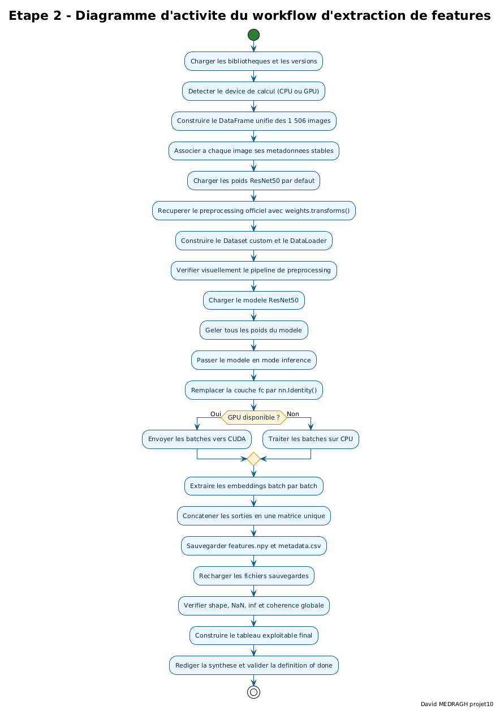
</p>

#### Architecture technique de l'extraction

Ce diagramme de composants montre comment le notebook orchestre le dataset source, le DataFrame unifie, le preprocessing officiel, le DataLoader, ResNet50 et les fichiers de sortie.

<p align="center">
  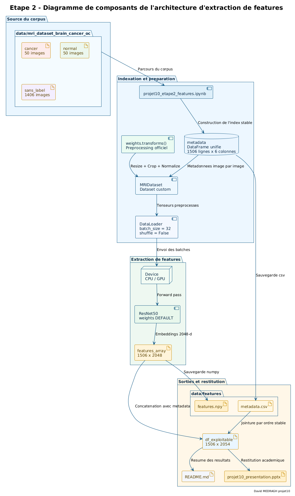
</p>

#### Pipeline de preprocessing ResNet50

Ce diagramme d'activite detaille les transformations appliquees a chaque image avant son passage dans ResNet50 : ouverture, conversion RGB, resize, center crop, tensorisation et normalisation.

<p align="center">
  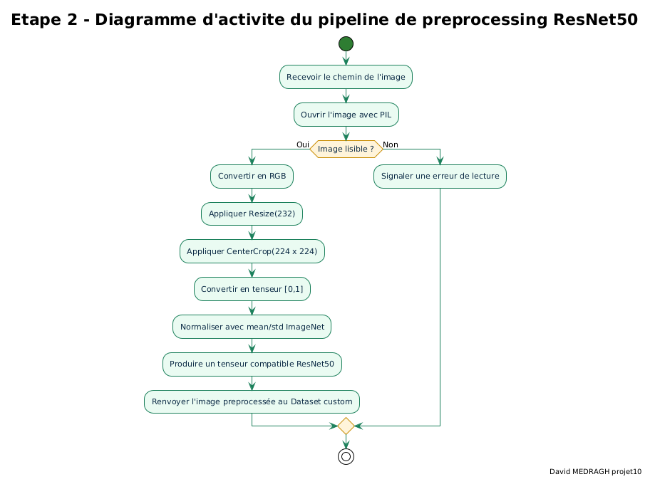
</p>

#### Extraction des embeddings en batch

Ce diagramme d'activite se concentre sur la phase d'inference : gel des poids, mode eval, passage batch par batch et concatenation de la matrice finale.

<p align="center">
  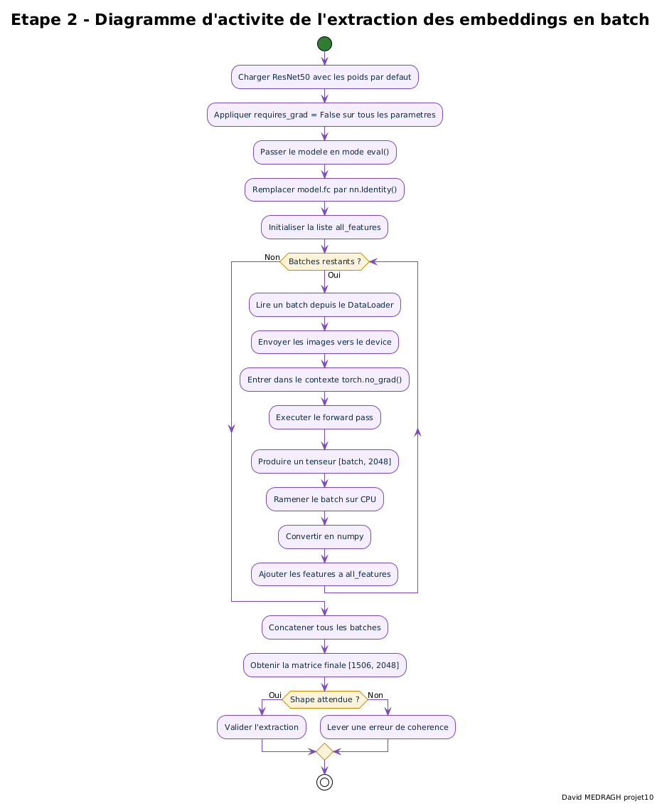
</p>

#### Séquence d'extraction des embeddings

Ce diagramme de sequence represente les interactions entre le notebook, le DataFrame de metadonnees, le Dataset custom, le DataLoader, ResNet50, NumPy, pandas et les fichiers de sortie.

<p align="center">
  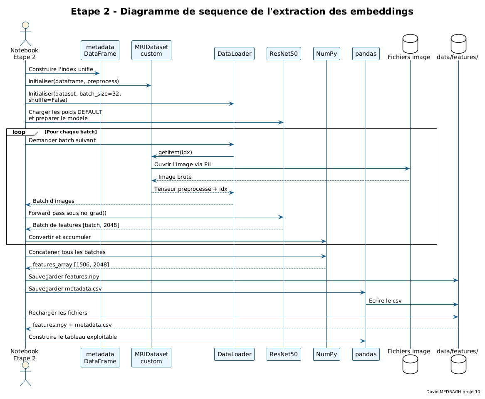
</p>

#### Cycle de vie d'une image vers son embedding

Ce diagramme d'etats suit une image individuelle depuis sa detection dans le corpus jusqu'a son embedding valide et relie aux metadonnees.

<p align="center">
  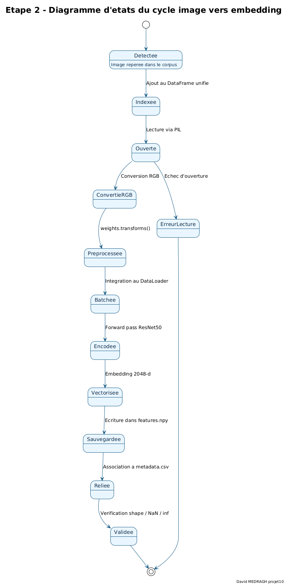
</p>

#### Structure logique des sorties features

Ce diagramme de packages relie le corpus source, le notebook de l'etape 2, le dossier `data/features/` et le tableau exploitable final.

<p align="center">
  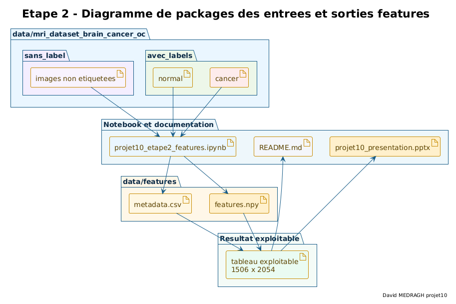
</p>

#### Cas d'usage de l'extraction de features

Ce diagramme de cas d'usage resume les actions principales realisees pendant l'etape 2 du point de vue du Data Scientist junior.

<p align="center">
  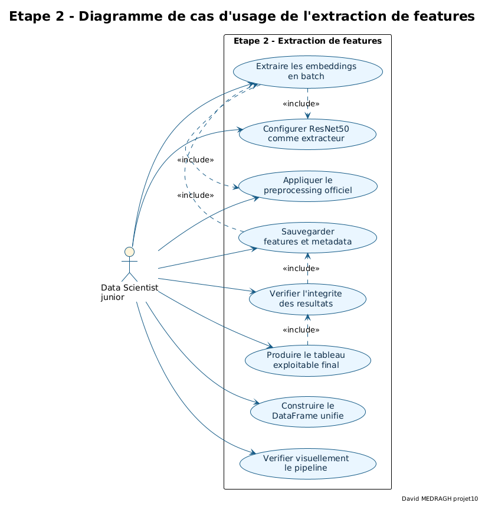
</p>

### Livrables produits

| Livrable | Chemin |
|----------|--------|
| Notebook d'extraction | `projet10_etape2_features.ipynb` |
| Support de présentation | `livrables/projet10_presentation.pptx` |
| Matrice de features | `data/features/features.npy` |
| Métadonnées | `data/features/metadata.csv` |
| Infographies étape 2 | `doc/png/projet10_etape2_*.png` |
| Sources PlantUML | `doc/uml/` |
| Exports PNG des diagrammes | `doc/uml/png/` |

## Étape 3 — Réalisez une analyse non supervisée

### Objectif

Je réduis la dimensionnalité des features extraites à l'étape 2 (2 048 dimensions par image), j'applique des méthodes de clustering pour identifier des regroupements naturels, et je produis une labellisation « faible » des 1 406 images non labellisées.

L'objectif final est de préparer un jeu pseudo-labellisé qui servira de base à l'étape 4 (apprentissage semi-supervisé).

### Standardisation des features

Les features issues de ResNet50 sont des sorties de couche ReLU : elles sont positives, non centrées et de magnitudes variables selon les neurones. Avant toute opération de distance ou de décomposition, je standardise chaque dimension (mean=0, std=1) avec `StandardScaler`.

| Statistique | Avant | Après |
|-------------|-------|-------|
| Mean | 0.1007 | ≈ 0 |
| Std | 0.3043 | 1.0000 |

### Réduction de dimensionnalité (PCA)

#### Variance expliquée

J'applique une PCA exploratoire sur 100 composantes pour observer la distribution de la variance :

- **100 composantes** → 58,14 % de variance expliquée
- **50 composantes** → 46,17 % de variance expliquée
- **90 % de variance** → non atteint avec 100 composantes

Ce résultat montre que l'information est très distribuée dans les 2 048 dimensions de ResNet50. C'est cohérent avec le fait que le modèle a été pré-entraîné sur ImageNet (1 000 classes très variées).

#### PCA intermédiaire (50D)

Je retiens 50 composantes comme compromis pour les étapes suivantes :
- **t-SNE** : fonctionne mieux en dimension modérée
- **DBSCAN** : les distances euclidiennes deviennent instables en très haute dimension
- 50 composantes captent ~46 % de la variance tout en réduisant le bruit des dimensions peu informatives

### Visualisation t-SNE

t-SNE (t-distributed Stochastic Neighbor Embedding) est appliqué sur les 50 composantes PCA pour produire une projection 2D qui préserve les voisinages locaux.

**⚠️ t-SNE est utilisé uniquement pour la visualisation** — je ne base aucune décision de clustering sur l'apparence du nuage t-SNE, car cet algorithme ne préserve pas les distances globales.

La visualisation montre une certaine structure dans les données, avec les images labellisées (cancer en rouge, normal en vert) tendant à se regrouper.

### Clustering

#### K-Means (k=2)

J'applique K-Means avec k=2 (imposé par la consigne : 2 classes) sur les features standardisées complètes (2 048 dimensions).

| Cluster | Effectif |
|---------|----------|
| 0 | 582 |
| 1 | 924 |

Inertie : 2 914 166,75

#### DBSCAN

DBSCAN est appliqué sur l'espace PCA 50D avec `eps` estimé par heuristique (médiane des distances au 5e voisin = 17,75).

| Résultat | Valeur |
|----------|--------|
| Clusters identifiés | 1 |
| Points bruit (-1) | 618 (41 %) |
| Points dans le cluster 0 | 888 |

DBSCAN échoue à identifier 2 clusters distincts dans cet espace 50D. Cela illustre une limite classique : DBSCAN est sensible à la dimensionnalité et à l'homogénéité de densité.

### Évaluation : score ARI

L'Adjusted Rand Index (ARI) mesure l'alignement entre les clusters prédits et les vrais labels. Il est calculé **uniquement sur les 100 images fortement labellisées**.

| Méthode | ARI | Interprétation |
|---------|-----|----------------|
| K-Means (k=2) | **0.1538** | Alignement modéré — capte partiellement la structure |
| DBSCAN | 0.0000 | Aucune séparation (1 seul cluster + bruit) |

### Mapping cluster → classe

Par **vote majoritaire** sur les 100 images fortement labellisées :

| Cluster K-Means | Cancer (label fort) | Normal (label fort) | → Classe assignée |
|-----------------|---------------------|---------------------|-------------------|
| 0 | 22 | 2 | **cancer** |
| 1 | 28 | 48 | **normal** |

### Pseudo-labellisation

J'attribue les pseudo-labels K-Means **uniquement aux 1 406 images non labellisées** :

| Pseudo-label | Effectif |
|--------------|----------|
| cancer | 558 |
| normal | 848 |

Le résultat est sauvegardé dans `data/features/metadata_weak_labels.csv`, un fichier **séparé** du jeu fortement labellisé (`metadata.csv` reste intact).

### Synthèses visuelles

Deux infographies de synthèse complètent cette étape. Elles donnent une lecture plus visuelle du pipeline de clustering, de la standardisation jusqu'à la pseudo-labellisation, en gardant la séparation entre labels forts et labels faibles.

#### Architecture générale de l'étape 3

Cette première vue d'ensemble résume les entrées de l'étape 3, la standardisation des features, la réduction de dimension, le clustering, l'évaluation par ARI et la production du jeu faiblement labellisé.

<p align="center">
  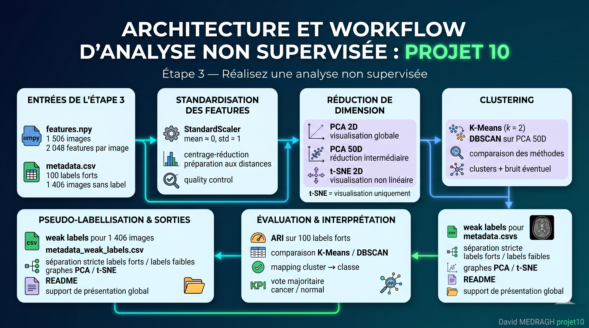
</p>

#### Architecture détaillée de l'étape 3

Cette vue détaillée met davantage en avant les transformations intermédiaires, les choix de méthodes, les contrôles d'évaluation et la logique de séparation des sorties produites pendant le clustering.

<p align="center">
  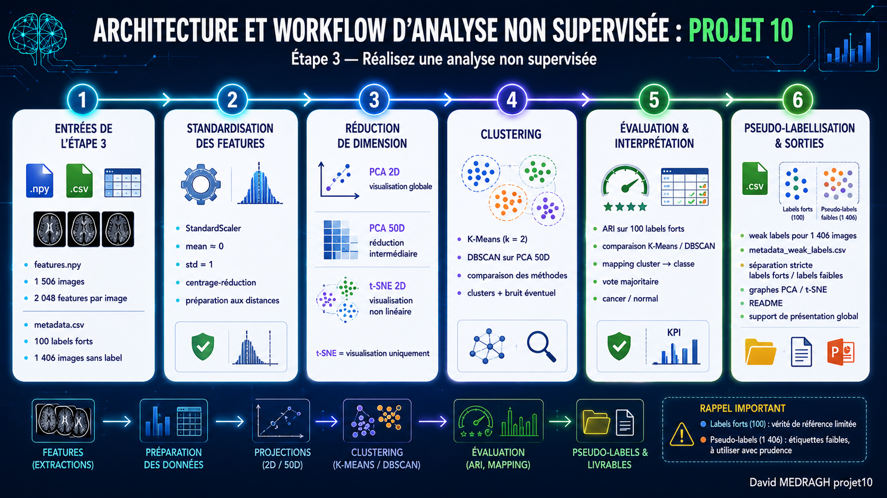
</p>

#### Stack technique de l'étape 3

Cette vue de synthèse recentre l'attention sur l'environnement Python, l'orchestration du notebook, la standardisation, la réduction de dimension, le clustering, l'évaluation et la restitution des résultats.

<p align="center">
  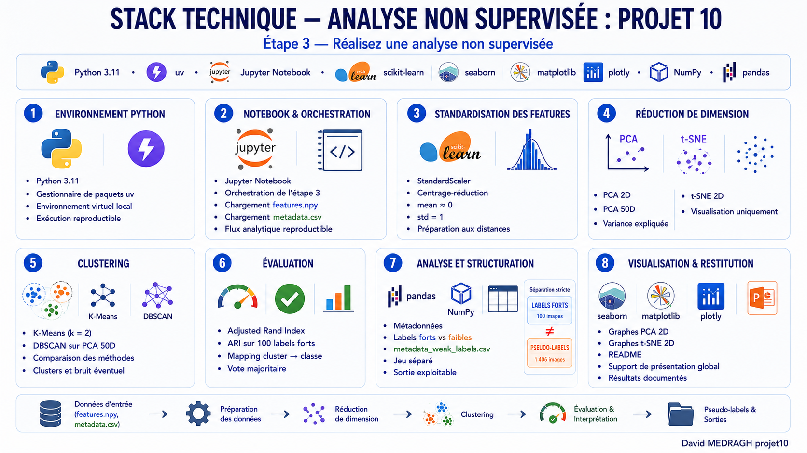
</p>

#### Stack technique de l'étape 3 — variante

Cette variante plus détaillée donne une autre lecture de la chaîne technique mobilisée pendant l'analyse non supervisée, du prétraitement des données jusqu'à la visualisation et l'interprétation.

<p align="center">
  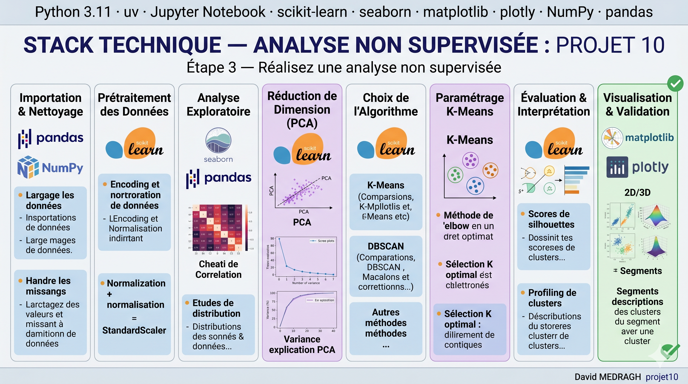
</p>

### Discussion

**Pourquoi l'ARI est modéré (0.15) :**
- Les features ResNet50 proviennent d'un modèle entraîné sur ImageNet (images naturelles), pas sur de l'imagerie médicale
- La variance est très distribuée : le signal discriminant cancer/normal est dilué dans 2 048 dimensions
- La distinction entre un cerveau sain et un cerveau avec tumeur en IRM est subtile au niveau des features globales

**Limites :**
- Les pseudo-labels sont une approximation — leur qualité dépend directement du clustering
- Le vote majoritaire repose sur 100 images seulement (échantillon limité)
- Les images classées « bruit » par DBSCAN ne reçoivent pas de pseudo-label dans cette approche

**Perspective pour l'étape 4 :**
Les pseudo-labels serviront de point de départ à l'apprentissage semi-supervisé. L'étape 4 affinera ces prédictions en exploitant conjointement les 100 labels forts et les 1 406 pseudo-labels.

### Diagrammes UML

Pour documenter l'étape 3, j'ai préparé une série de diagrammes UML en PlantUML. Ils montrent la logique de standardisation, de réduction de dimension, de clustering, d'évaluation par ARI et de pseudo-labellisation, tout en gardant la séparation stricte entre labels forts et labels faibles.

#### Workflow global de l'analyse non supervisée

Ce diagramme d'activité synthétise le déroulé complet de l'étape 3, du chargement des features jusqu'à la sauvegarde du jeu faiblement labellisé.

<p align="center">
  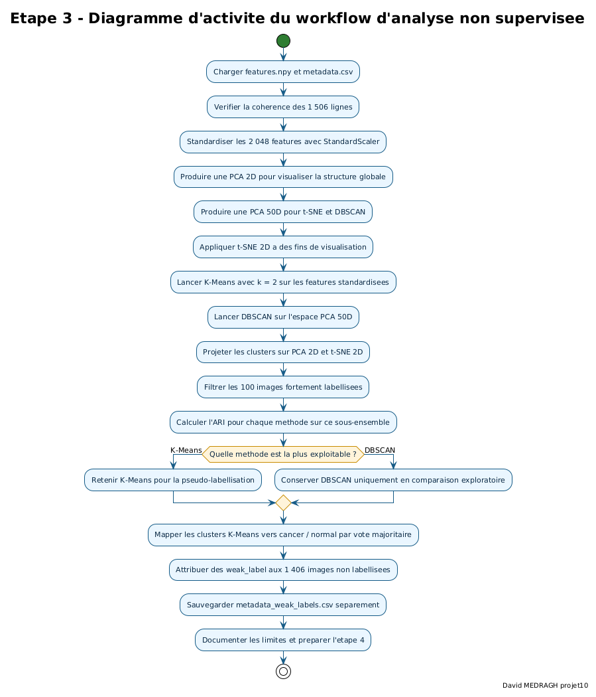
</p>

#### Architecture technique du clustering

Ce diagramme de composants montre comment le notebook orchestre `features.npy`, `metadata.csv`, la standardisation, PCA, t-SNE, K-Means, DBSCAN, l'ARI et `metadata_weak_labels.csv`.

<p align="center">
  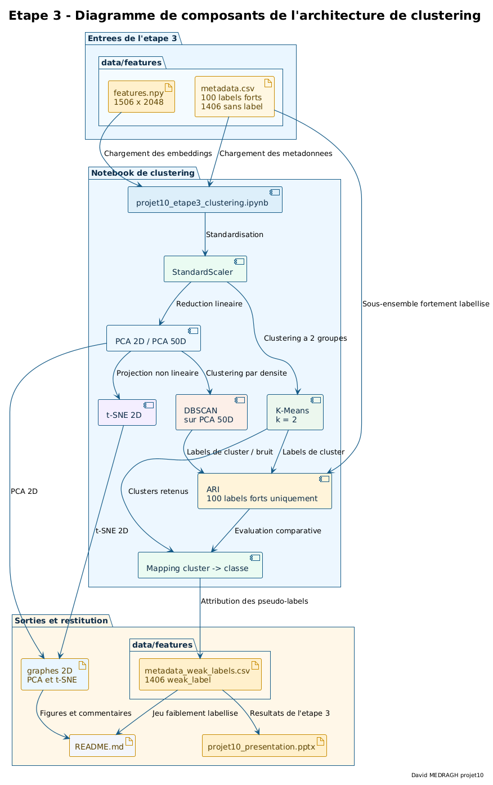
</p>

#### Standardisation des features

Ce diagramme d'activité détaille la transformation des 2 048 features par `StandardScaler`, avec contrôle de la shape et validation du centrage-réduction.

<p align="center">
  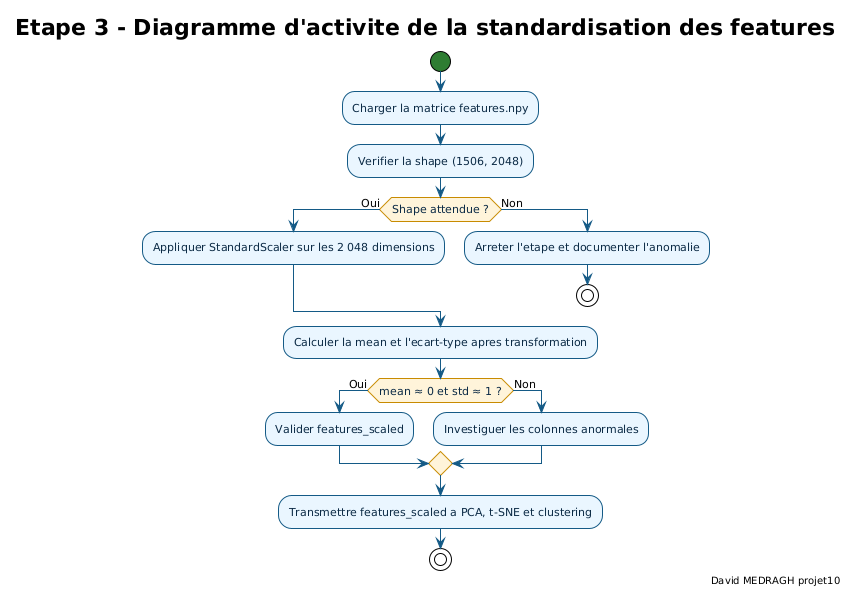
</p>

#### Réduction de dimension PCA et t-SNE

Ce diagramme d'activité explicite la double logique de réduction : une PCA 2D pour la vue globale, puis une PCA 50D suivie d'un t-SNE pour la visualisation non linéaire.

<p align="center">
  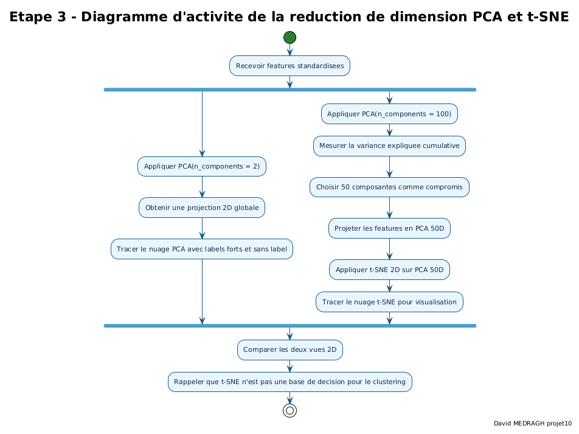
</p>

#### Clustering K-Means et DBSCAN

Ce diagramme d'activité compare les deux branches de clustering testées dans cette étape : K-Means avec `k=2` et DBSCAN dans l'espace PCA 50D.

<p align="center">
  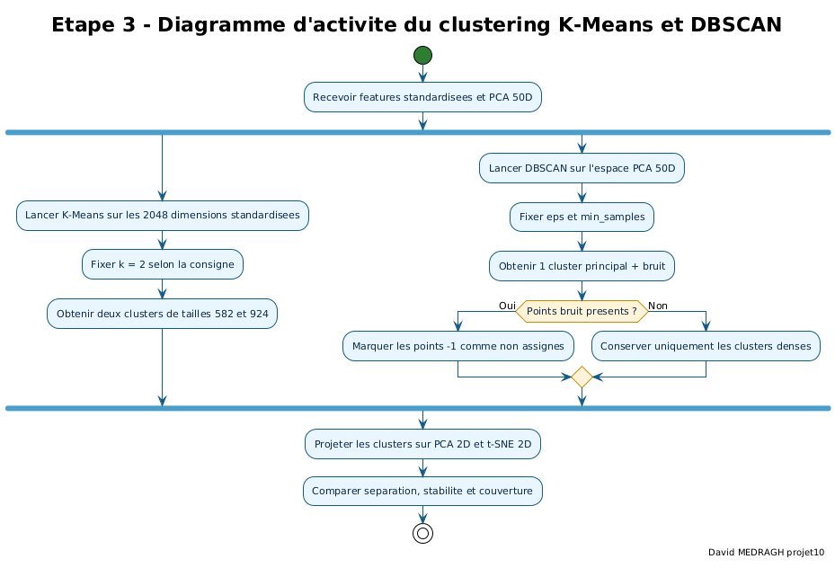
</p>

#### Évaluation par ARI

Ce diagramme d'activité rappelle que l'ARI est calculé uniquement sur les 100 images fortement labellisées, jamais sur les 1 406 images sans vérité terrain.

<p align="center">
  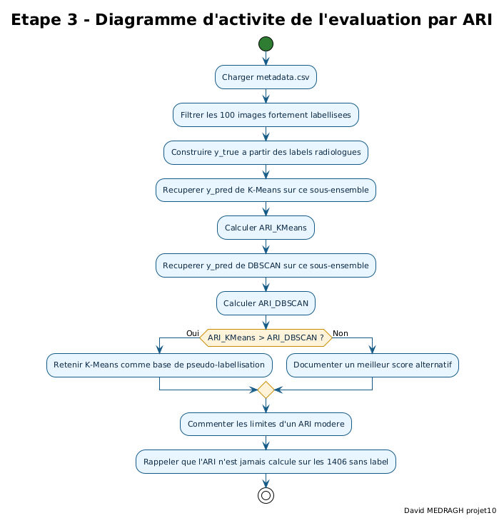
</p>

#### Pseudo-labellisation séparée

Ce diagramme d'activité met en avant la séparation stricte entre le jeu fortement labellisé (`metadata.csv`) et le jeu faiblement labellisé (`metadata_weak_labels.csv`).

<p align="center">
  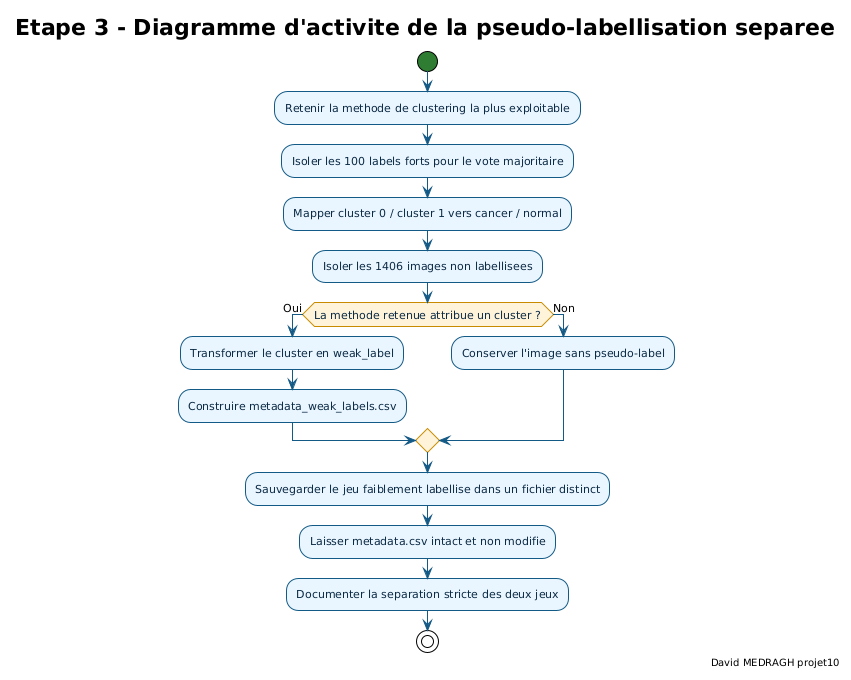
</p>

#### Séquence du pipeline de clustering

Ce diagramme de séquence représente les interactions entre le notebook, les fichiers d'entrée, les algorithmes de réduction, les méthodes de clustering, l'ARI et la sortie de pseudo-labels.

<p align="center">
  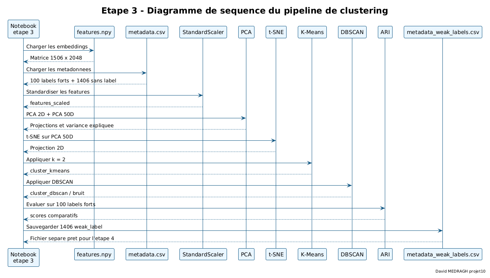
</p>

#### Cycle d'une image vers son pseudo-label

Ce diagramme d'états suit une image individuelle depuis sa feature chargée jusqu'à son éventuel pseudo-label, ou jusqu'au statut de bruit si elle n'est pas assignée par DBSCAN.

<p align="center">
  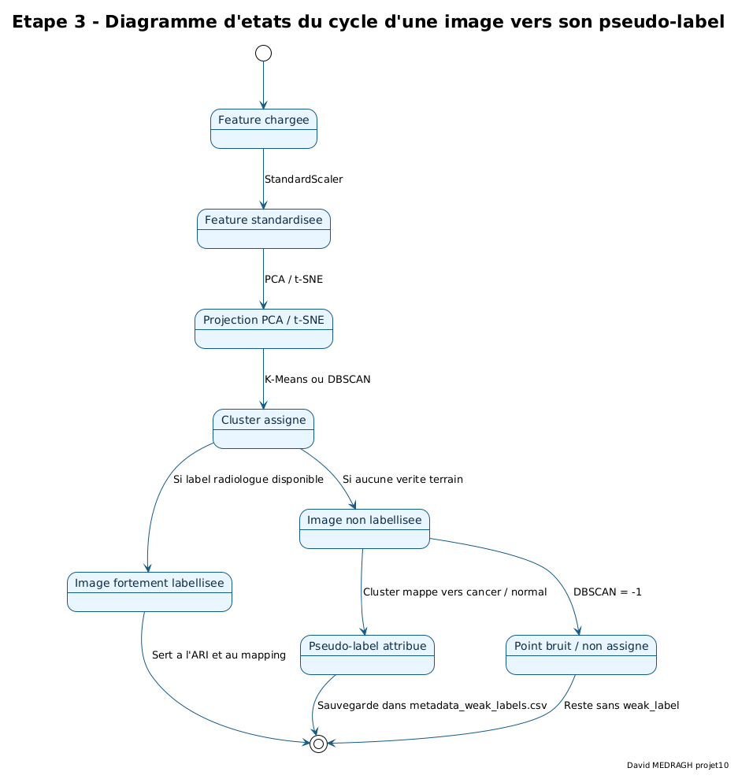
</p>

#### Structure des sorties clustering

Ce diagramme de packages relie les entrées `features.npy` et `metadata.csv`, le notebook de clustering, les graphes 2D, l'ARI et le fichier `metadata_weak_labels.csv`.

<p align="center">
  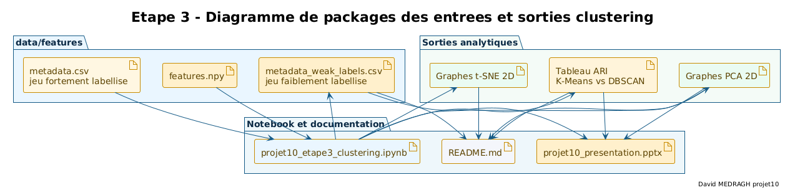
</p>

#### Cas d'usage de l'analyse non supervisée

Ce diagramme de cas d'usage résume les actions principales réalisées dans l'étape 3 du point de vue du Data Scientist junior.

<p align="center">
  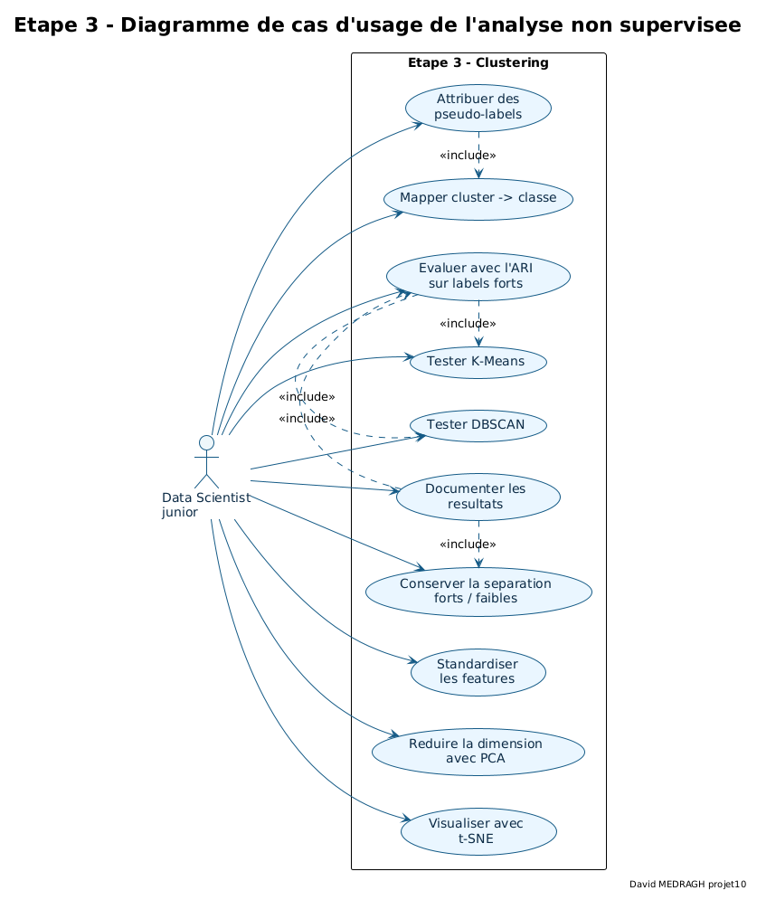
</p>

### Livrables produits

| Fichier | Description |
|---------|-------------|
| `projet10_etape3_clustering.ipynb` | Notebook complet : standardisation, PCA, t-SNE, K-Means, DBSCAN, ARI, pseudo-labellisation |
| `data/features/metadata_weak_labels.csv` | 1 406 images avec pseudo-labels (jeu faiblement labellisé, séparé) |
| `doc/png/projet10_etape3_architecture_generale.png` | Vue d'ensemble de l'architecture de l'étape 3 |
| `doc/png/projet10_etape3_architecture_detaillee.png` | Vue détaillée de l'architecture de l'étape 3 |
| `doc/png/projet10_etape3_stack_technique.png` | Vue d'ensemble de la stack technique de l'étape 3 |
| `doc/png/projet10_etape3_stack_technique_2.png` | Variante détaillée de la stack technique de l'étape 3 |
| `doc/uml/` | Sources PlantUML des diagrammes de l'étape 3 |
| `doc/uml/png/` | Exports PNG des diagrammes de l'étape 3 |

## Étape 4 — Appliquez une méthode semi-supervisée

### Objectif

J'entraîne un CNN (ResNet50 fine-tuné) selon deux approches et je compare leurs performances :
- **Modèle A** : supervisé pur (entraîné uniquement sur les 64 images fortement labellisées)
- **Modèle B** : semi-supervisé (pré-entraîné sur 1 406 pseudo-labels, puis fine-tuné sur les 64 images fortes)

L'objectif est de mesurer si l'exploitation des pseudo-labels (labellisation faible produite à l'étape 3) apporte un gain par rapport à un entraînement supervisé classique.

### Protocole anti-fuite

À l'étape 3, le clustering K-Means avait été calculé sur les 1 506 images (incluant les 20 futures images test), et le mapping utilisait les 100 labels forts complets. Cela constitue une fuite d'information.

En étape 4, je corrige cela :
1. **Split fixe** avant toute opération (80/20 stratifié sur les 100 labels forts)
2. **Re-fit K-Means** sur 1 486 images (sans les 20 test)
3. **Re-mapping** cluster→classe par vote majoritaire sur les **64 images train uniquement**
4. **Re-génération** des weak labels pour les 1 406 images non labellisées

### Split des données

| Jeu | Effectif | Rôle |
|-----|----------|------|
| Train (fort) | 64 (32 cancer, 32 normal) | Entraînement / fine-tuning |
| Val (fort) | 16 (8 cancer, 8 normal) | Early stopping |
| Test (fort) | 20 (10 cancer, 10 normal) | Évaluation finale (touché 1 fois) |
| Weak (pseudo) | 1 406 (506 cancer, 900 normal) | Pré-entraînement modèle B |

Tous les splits sont stratifiés (`random_state=42`). Le jeu test n'intervient dans aucune décision.

### Re-clustering propre

Le re-clustering sur 1 486 images (sans test) donne un mapping légèrement différent : 52 images sur 1 406 (3,7 %) changent de pseudo-label par rapport à l'étape 3. Cela confirme que la fuite, bien que faible en pratique, existe et doit être corrigée pour la rigueur méthodologique.

### Architecture CNN

| Aspect | Choix | Justification |
|--------|-------|---------------|
| Modèle | ResNet50 fine-tuné | Cohérence étape 2, transfer learning |
| Couches dégelées | layer4 + fc | Compromis : features haut niveau adaptées, bas niveau ImageNet préservé |
| fc | Linear(2048, 2) | 2 classes : cancer / normal |
| Params entraînables | 14,9M (63,7 %) | |
| Loss | CrossEntropyLoss | Standard classification |
| Optimiseur | Adam, lr=1e-4 | Adapté au fine-tuning |
| Early stopping | Patience=5 sur val_loss | Évite l'overfitting |
| Sampler weak | WeightedRandomSampler | Compense le déséquilibre 506/900 |

### Modèle A — Supervisé pur

- Entraîné sur 64 images fortes, val 16, early stopping patience=5
- Convergence à l'époque 4 (early stop époque 9)
- Temps : ~56s (CPU)

### Modèle B — Semi-supervisé

**Phase 1** — Pré-entraînement sur 1 406 weak labels :
- 10 époques, pas d'early stopping (pas de val fiable)
- Temps : ~19 min (CPU)
- Résultat post-weak (évalué sur val, pas test) : F1=0.56, recall cancer=0.25 — médiocre seul

**Phase 2** — Fine-tuning sur 64 images fortes :
- Même protocole que modèle A (val 16, early stopping patience=5)
- Convergence à l'époque 9 (early stop époque 14)
- Temps : ~84s (CPU)

### Comparaison des résultats

| Modèle | F1 (macro) | Accuracy | Recall cancer | Précision cancer |
|--------|-----------|----------|---------------|-----------------|
| A — Supervisé pur | 0.79 | 0.80 | 0.60 | 1.00 |
| **B — Semi-supervisé** | **0.85** | **0.85** | **0.70** | **1.00** |
| Δ (B − A) | +0.05 | +0.05 | +0.10 | 0 |

**L'approche semi-supervisée apporte un gain** : +5 points de F1 et +10 points de recall cancer. Le modèle B détecte 1 cancer supplémentaire sur 10 par rapport au modèle A, sans perdre en précision.

### Justification métier

Dans un contexte de détection de tumeurs (CurelyticsIA), un **Faux Négatif** (cancer prédit comme normal) est l'erreur la plus grave. Le **Recall cancer** est donc la métrique reine. Le modèle B l'améliore de 60 % à 70 %.

### Recommandations — Passage à l'échelle

**Question de Clara** : 5 000 € pour 4 millions d'images à labelliser. Est-ce faisable ?

**Réponse** : oui, sous certaines conditions.

| Scénario | Approche | Coût estimé |
|----------|----------|-------------|
| Inférence du modèle | GPU cloud (~100-200 img/s) pour 4M images → 6-11h | 3-11 € |
| Active learning | Inférence + labellisation humaine ciblée (~100k images incertaines) | ~5 000 € |
| Labellisation exhaustive | 4M × 0,05 €/image humaine | ~200 000 € (hors budget) |

L'approche recommandée est le **scénario 2 (active learning itératif)** : inférer avec le modèle, cibler les images les plus incertaines pour vérification humaine, réentraîner, itérer.

### Synthèses visuelles

#### Architecture générale de l'étape 4

Cette vue d'ensemble résume la chaîne complète de l'apprentissage semi-supervisé : séparation stricte des jeux, préparation des données, entraînement comparatif et évaluation finale.

<p align="center">
  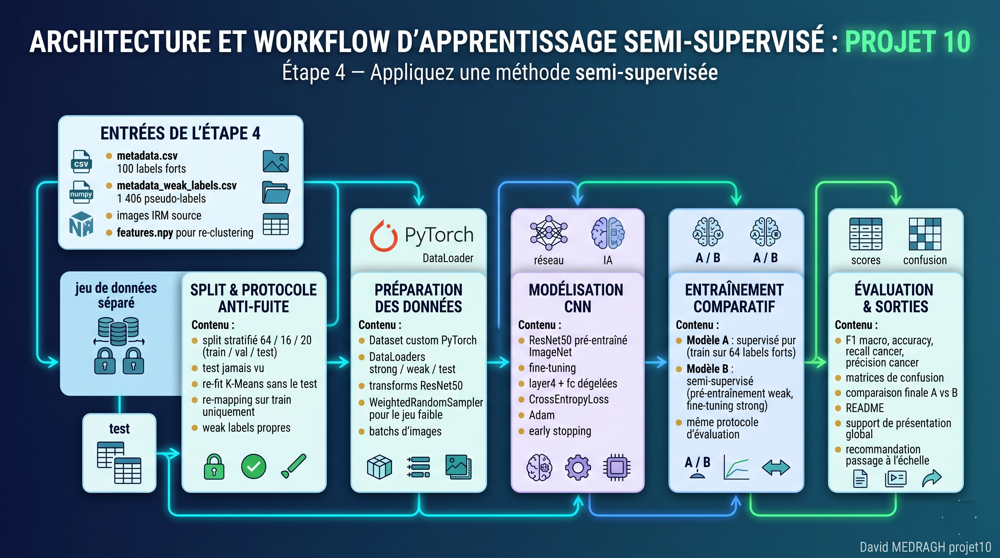
</p>

#### Architecture détaillée de l'étape 4

Cette version détaillée met davantage l'accent sur la logique anti-fuite, les DataLoaders PyTorch, le fine-tuning de ResNet50 et la comparaison finale entre les modèles A et B.

<p align="center">
  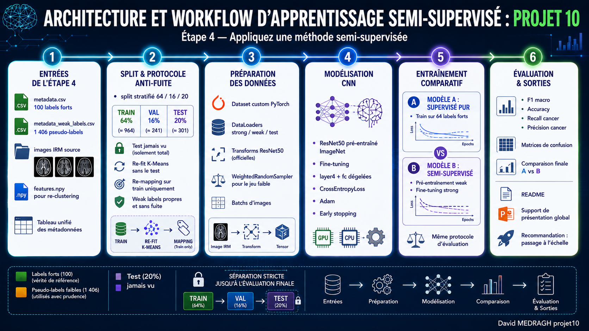
</p>

#### Stack technique générale de l'étape 4

Cette synthèse technique met en avant les bibliothèques principales mobilisées dans l'étape 4 pour préparer les jeux, entraîner les modèles CNN et comparer les performances.

<p align="center">
  
</p>

#### Stack technique détaillée de l'étape 4

Cette vue détaillée explicite plus finement les rôles de `PyTorch`, `torchvision`, `pandas`, `scikit-learn`, `seaborn` et `matplotlib` dans le protocole semi-supervisé.

<p align="center">
  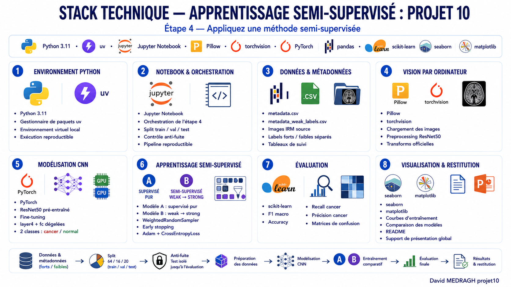
</p>

### Diagrammes UML

Pour documenter l'étape 4, j'ai préparé une série de diagrammes UML en PlantUML. Ils détaillent la logique anti-fuite, la préparation des DataLoaders, le fine-tuning de ResNet50, les deux protocoles d'entraînement et la comparaison finale entre approche supervisée pure et approche semi-supervisée.

#### Workflow global de l'apprentissage semi-supervisé

Ce diagramme d'activité synthétise le déroulé complet de l'étape 4, du split initial jusqu'à la comparaison finale des deux modèles.

<p align="center">
  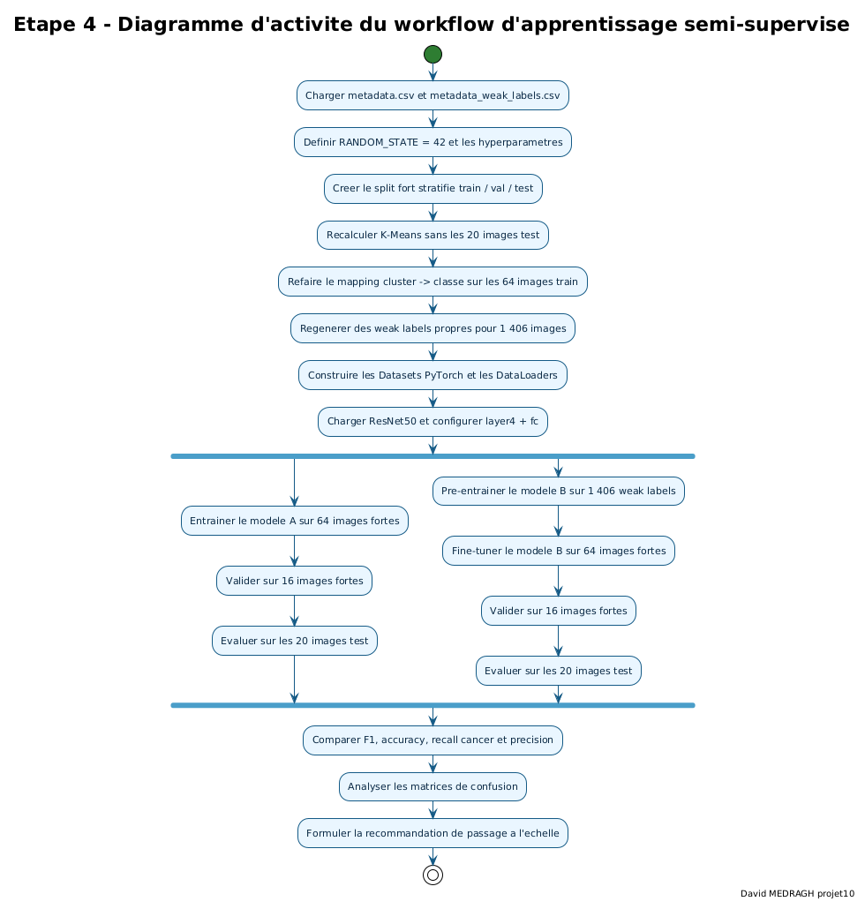
</p>

#### Architecture technique CNN semi-supervisée

Ce diagramme de composants montre comment le notebook orchestre les jeux forts et faibles, le re-clustering, les DataLoaders, ResNet50, les métriques et les sorties finales.

<p align="center">
  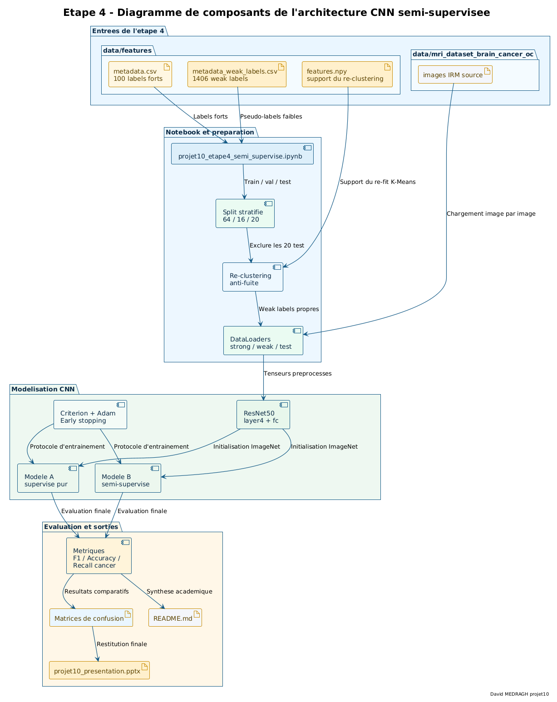
</p>

#### Split et logique anti-fuite

Ce diagramme d'activité met en avant la correction méthodologique essentielle de l'étape 4 : split fixe, exclusion du test du re-clustering et remapping strictement limité au train.

<p align="center">
  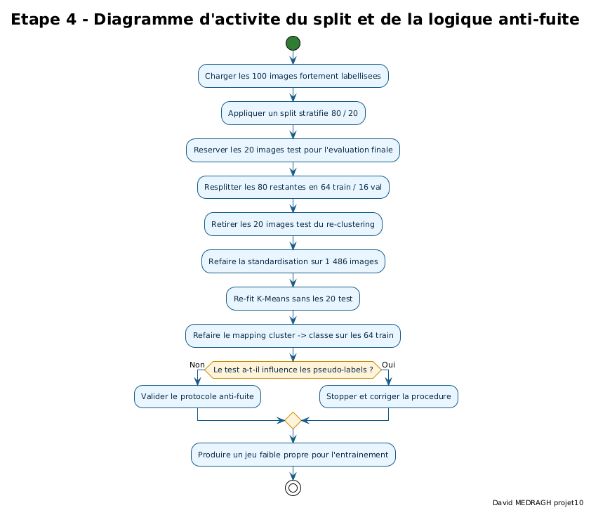
</p>

#### Préparation des DataLoaders

Ce diagramme d'activité résume la construction des jeux `strong`, `weak`, `val` et `test`, ainsi que l'utilisation du `WeightedRandomSampler` pour le jeu faible.

<p align="center">
  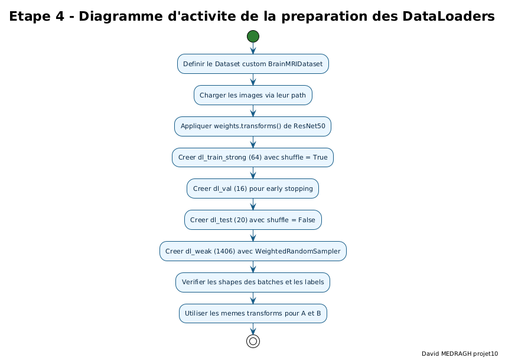
</p>

#### Fine-tuning de ResNet50

Ce diagramme d'activité explicite la configuration commune des modèles A et B : poids ImageNet, couches gelées, `layer4 + fc` dégelées, loss et optimiseur.

<p align="center">
  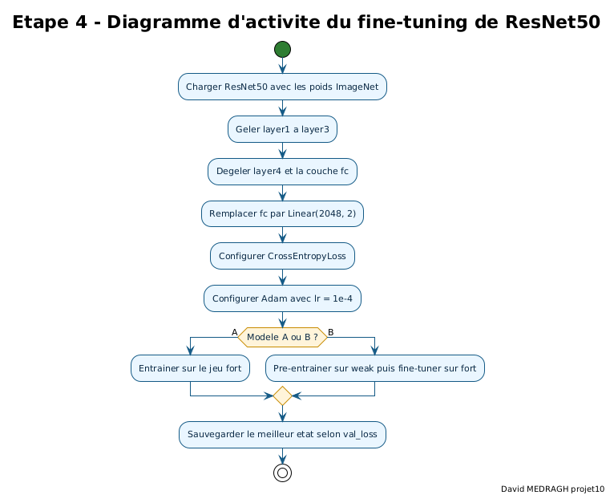
</p>

#### Entraînement supervisé pur

Ce diagramme d'activité décrit le protocole du modèle A : entraînement sur 64 images fortes, validation sur 16 images et test final sur 20 images jamais vues.

<p align="center">
  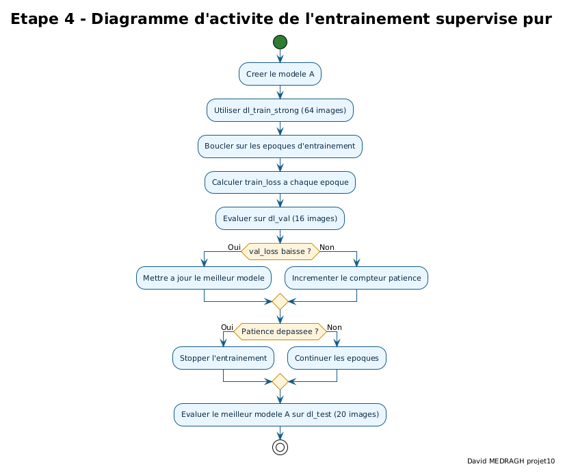
</p>

#### Entraînement semi-supervisé

Ce diagramme d'activité décrit le protocole du modèle B : pré-entraînement sur 1 406 pseudo-labels, puis fine-tuning supervisé sur les 64 images fortes.

<p align="center">
  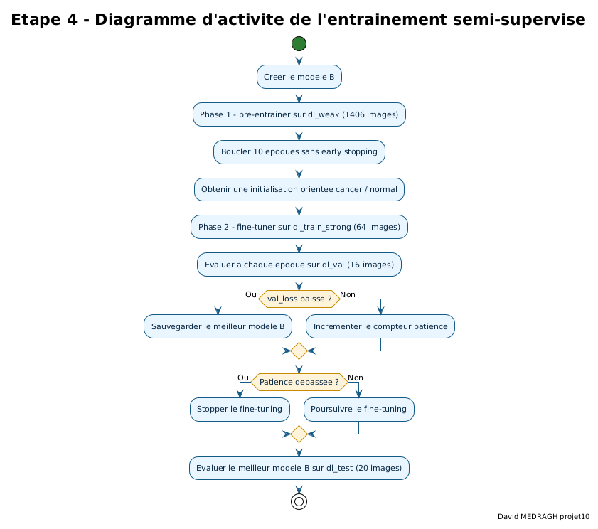
</p>

#### Évaluation des métriques

Ce diagramme d'activité résume le calcul et l'interprétation des métriques retenues : F1 macro, accuracy, recall cancer, précision cancer et matrices de confusion.

<p align="center">
  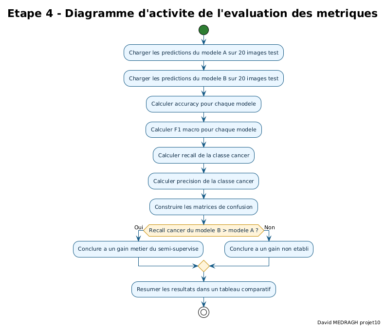
</p>

#### Comparaison supervisé pur vs semi-supervisé

Ce diagramme d'activité structure la comparaison finale entre le modèle A et le modèle B, avec un accent particulier sur le recall cancer.

<p align="center">
  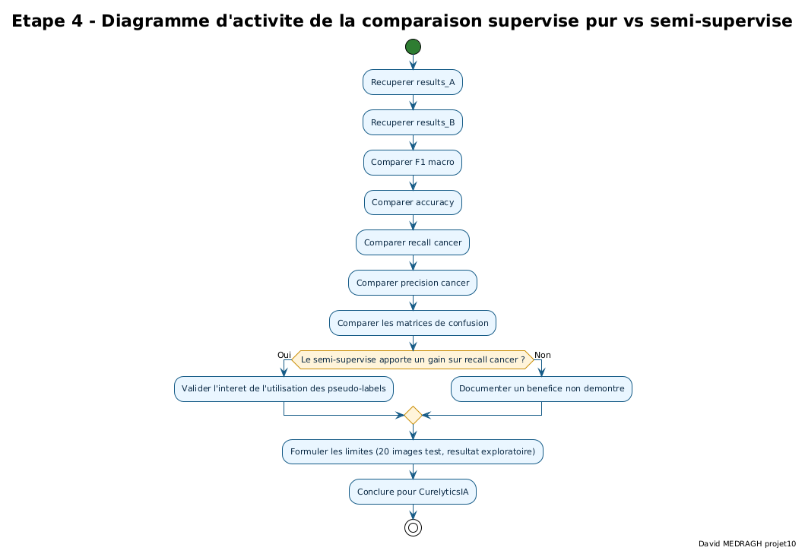
</p>

#### Séquence du pipeline semi-supervisé

Ce diagramme de séquence représente les interactions entre le notebook, les métadonnées, le re-clustering, les DataLoaders, les deux modèles ResNet50 et l'évaluateur de métriques.

<p align="center">
  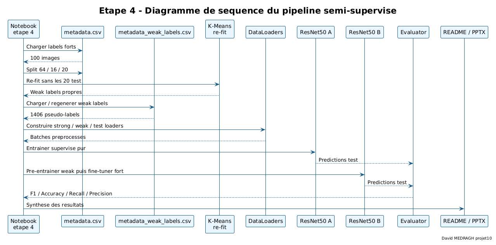
</p>

#### Cycle d'une image dans l'entraînement

Ce diagramme d'états suit une image depuis sa source jusqu'à sa prédiction finale, en distinguant image forte, image faible et image de test.

<p align="center">
  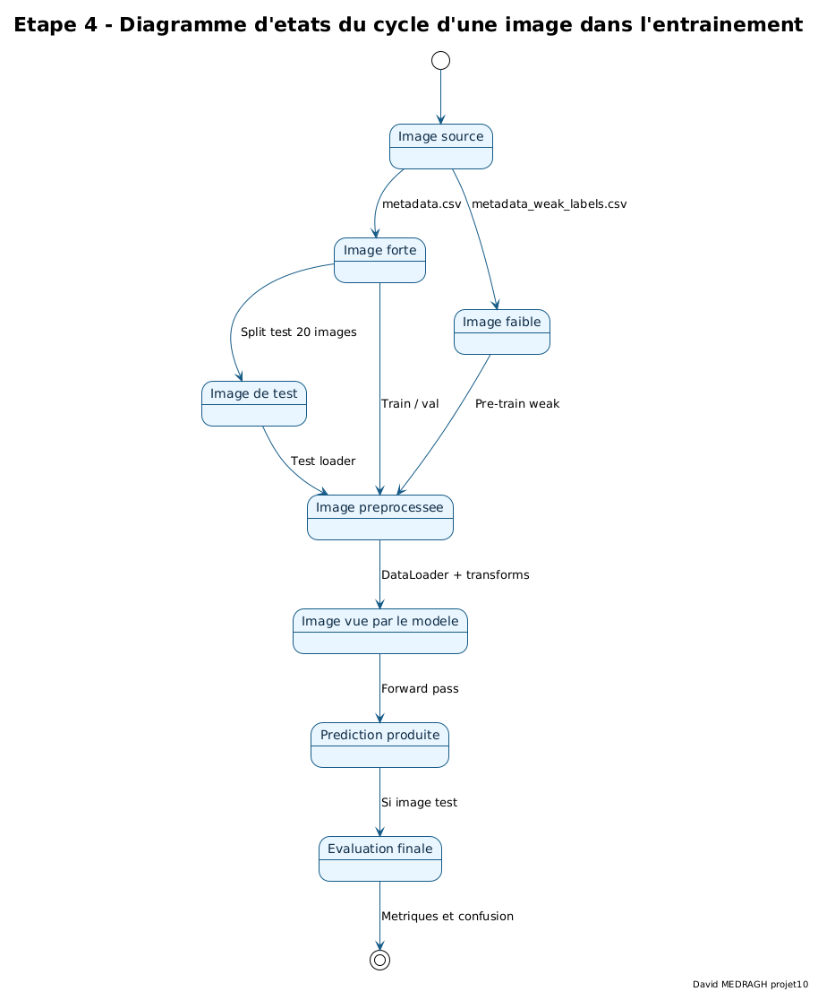
</p>

#### Structure des sorties semi-supervisées

Ce diagramme de packages relie les jeux d'entrée, le notebook de l'étape 4, le tableau de métriques, les matrices de confusion et le support de présentation global.

<p align="center">
  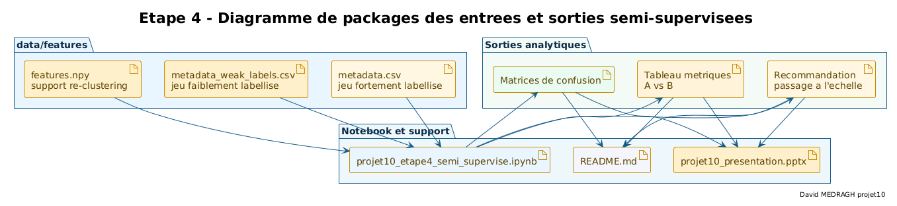
</p>

#### Cas d'usage de l'apprentissage semi-supervisé

Ce diagramme de cas d'usage résume les actions principales réalisées dans l'étape 4 du point de vue du Data Scientist junior.

<p align="center">
  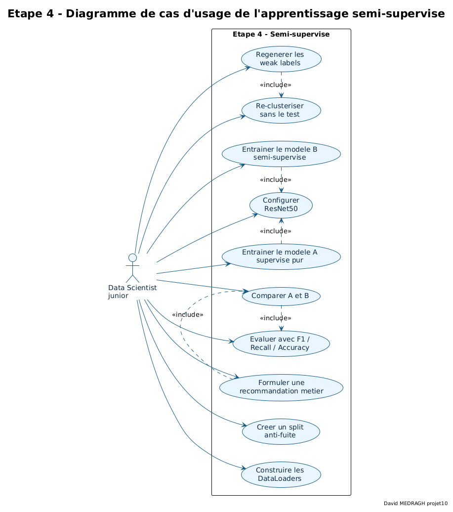
</p>

### Livrables produits

| Fichier | Description |
|---------|-------------|
| `projet10_etape4_semi_supervise.ipynb` | Notebook complet : split, re-clustering, CNN, comparaison, recommandations |
| `doc/png/projet10_etape4_architecture_generale.png` | Vue synthétique de l'architecture de l'étape 4 |
| `doc/png/projet10_etape4_architecture_detaillee.png` | Vue détaillée de l'architecture de l'étape 4 |
| `doc/png/projet10_etape4_stack_technique_generale.png` | Vue synthétique de la stack technique de l'étape 4 |
| `doc/png/projet10_etape4_stack_technique_detaillee.png` | Vue détaillée de la stack technique de l'étape 4 |
| `doc/uml/` | Sources PlantUML des diagrammes de l'étape 4 |
| `doc/uml/png/` | Exports PNG des diagrammes de l'étape 4 |
